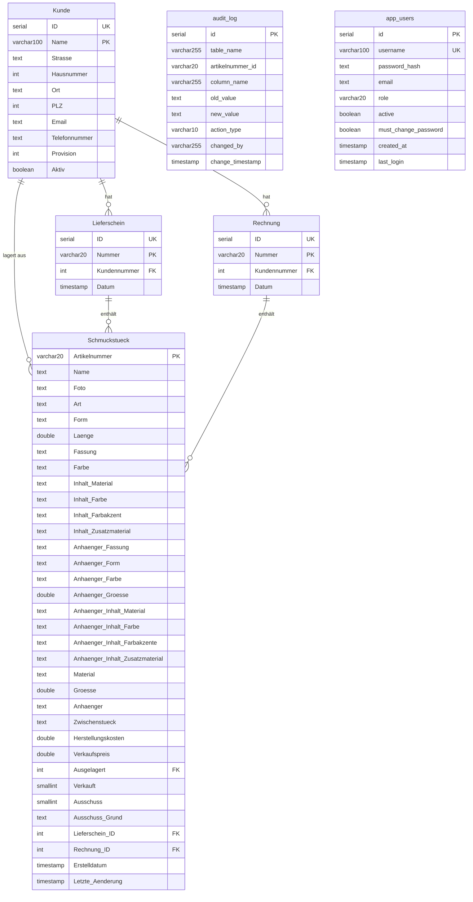

# GoldRegenDB – Schmuckverwaltung Web-Anwendung

## Projektübersicht

**GoldRegenDB** ist ein Warenwirtschaftssystem für handgefertigten Schmuck (Beton-, Perlen-, Holzschmuck u.a.).
Die Anwendung ist vollständig containerisiert (Docker) und basiert auf PostgreSQL, einem Node.js/Express-Backend und einem React-Frontend.

---

## Datenbankschema

### ER-Diagramm



### Tabellen-Übersicht

| Tabelle        | Beschreibung                    | PK                  | Geschätzter Umfang |
| -------------- | ------------------------------- | ------------------- | ------------------ |
| `Kunde`        | Kunden / Händler / Lagerorte    | `Name` (UK: `ID`)   | ~25 Einträge       |
| `Lieferschein` | Lieferscheine mit Artikellisten | `Nummer` (UK: `ID`) | ~180 Einträge      |
| `Rechnung`     | Rechnungen mit Artikellisten    | `Nummer`            | ~200 Einträge      |
| `Schmuckstück` | Schmuckstücke mit 34 Attributen | `Artikelnummer`     | ~4.000+ Einträge   |
| `audit_log`    | Änderungsprotokoll              | `id`                | ~4.000+ Einträge   |
| `app_users`    | Anwendungsbenutzer              | `id` (UK: `username`) | Wenige Einträge  |

### Beziehungen (Foreign Keys)

- `Lieferschein.Kundennummer` → `Kunde.ID`
- `Rechnung.Kundennummer` → `Kunde.ID`
- `Schmuckstück.Ausgelagert` → `Kunde.ID` (Auslagerung zu Händler)
- `Schmuckstück.Lieferschein_ID` → `Lieferschein.ID`
- `Schmuckstück.Rechnung_ID` → `Rechnung.ID`

### Wichtige Hinweise zum Schema

- `Schmuckstück.Ausgelagert`, `Verkauft`, `Ausschuss`, `Lieferschein_ID`, `Rechnung_ID` haben Standard-Wert `0` (nicht NULL)
- Filter auf "nicht zugeordnet" verwenden `... = 0`
- DB-Indizes: `idx_schmuck_ausgelagert`, `idx_schmuck_lieferschein`, `idx_schmuck_rechnung`

### Geschäftslogik

- **Kunden** sind Einzelhandelspartner (Läden, Online, Messen, Sonderanfertigung)
- **Provision**: variiert pro Kunde (0–40%)
- **Schmuckstücke** haben Suffix-Nummern (z.B. `MBH001_1`, `MBH001_2` = gleicher Typ, verschiedene Exemplare)
- **Artikelnummern-Präfixe**:
  - Erste Stelle (Hersteller):
    - `M` = Marina,
    - `S` = Saskia;
  - Zweite Stelle (Grundmaterial):
    - `A` = "Alkoholtinte",
    - `B` = "Beton",
    - `C` = "Cucio",
    - `E` = "Edelstahl",
    - `F` = "Fimo",
    - `H` = "Harz",
    - `I` = "Phiole",
    - `J` = "Papier",
    - `K` = "Kordel",
    - `L` = "Leder",
    - `M` = "Makramee",
    - `N` = "Naturstein",
    - `P` = "Perle",
    - `S` = "Schrumpffolie",
    - `W` = "Holz",
    - `X` = "3D-Druck"
    - `Y` = "Cabochon"
  - Dritte Stelle (Produktart):
    - `A` = "Armband",
    - `H` = "Halskette",
    - `O` = "Ohrring",
    - `S` = "Schlüsselanhänger",
- **Ausgelagert**: Referenz auf Kunden-ID, bei dem das Stück liegt (0 = im Lager)
- **Verkauft**: SMALLINT (0 = nicht verkauft, 1 = verkauft)
- **Ausschuss**: SMALLINT (0 = kein Ausschuss, 1 = aussortiert); bei Ausschuss=1 muss `Ausschuss_Grund` gesetzt sein
- **audit_log**: automatisches Änderungsprotokoll via DB-Trigger (überwacht: Verkauft, Ausgelagert, Ausschuss, Ausschuss_Grund, Lieferschein_ID, Rechnung_ID)
## WHERE Clause Builder (PFLICHT!)

**WICHTIG:** Für alle Datenbank-Queries, die Schmuckstücke filtern, **MUSS** der zentrale WHERE-Builder verwendet werden!

### Geschäftsregeln (konsistent in gesamter Codebasis!)

| Status | Regel | Code |
|--------|-------|------|
| **Verkauft** | `Verkauft = 1 UND Ausschuss = 0` | `builder.verkauft()` |
| **Ausschuss** | `Ausschuss = 1` | `builder.ausschuss()` |
| **Verfügbar** | `Verkauft = 0 UND Ausschuss = 0 UND Ausgelagert = 0` | `builder.verfuegbar()` |
| **Aktiv Ausgelagert** | `Ausgelagert > 0 UND Verkauft = 0 UND Ausschuss = 0` | `builder.aktivAusgelagert(kundeId?)` |

**⚠️ Verkauft ≠ Ausschuss** — Ein Schmuckstück kann niemals gleichzeitig verkauft UND Ausschuss sein!

### Verwendung

```javascript
const { where } = require('../utils/whereClauseBuilder');

// Einfaches Beispiel
const builder = where();
builder.verfuegbar();
const { rows } = await db.query(
  `SELECT * FROM "Schmuckstück" ${builder.build()}`,
  builder.getParams()
);

// Kombiniert
const builder = where();
builder.aktivAusgelagert(5);  // Bei Kunde 5
builder.grundmaterial('P');   // Perlen
builder.produktart('A');      // Armband
const query = `SELECT * FROM "Schmuckstück" ${builder.build()}`;
const result = await db.query(query, builder.getParams());
```

**📖 Vollständige Dokumentation:** [`backend/src/utils/WHERE_BUILDER.md`](../backend/src/utils/WHERE_BUILDER.md)

**✅ Migrierte Routes:** dashboard.js, schmuckstuecke.js, sumup.js, kunden.js, inventur.js
**⏳ Noch zu migrieren:** lieferscheine.js, rechnungen.js

---


---

## Technologie-Stack

| Komponente        | Technologie                              |
| ----------------- | ---------------------------------------- |
| **Datenbank**     | PostgreSQL 16                            |
| **Backend**       | Node.js + Express.js (REST API)          |
| **DB-Zugriff**    | `pg` (node-postgres) – kein ORM          |
| **Authentifizierung** | JWT (`jsonwebtoken`) + `bcryptjs`    |
| **Rate Limiting** | `express-rate-limit`                     |
| **Excel-Export**  | `exceljs`                                |
| **Bild-Validierung** | `image-size`                          |
| **Icons**         | Font Awesome (`@fortawesome/react-fontawesome`, `free-solid-svg-icons`, `free-regular-svg-icons`) |
| **Frontend**      | React 19 + Vite + React Router v7        |
| **Container**     | Docker + Docker Compose                  |
| **Dev-Umgebung**  | Docker Compose (dev) mit Hot-Reload      |
| **Produktion**    | Docker Compose (prod) mit Nginx          |

---

## Authentifizierung & Rollen

Die Anwendung nutzt **JWT-basierte Authentifizierung**.

### Rollen

| Rolle        | Seiten / Berechtigungen                                                                      |
| ------------ | -------------------------------------------------------------------------------------------- |
| `user`       | Schmuckstücke erstellen (nur POST /api/schmuckstuecke)                                       |
| `bearbeiter` | Dashboard, Kunden, Schmuckstücke, Lieferscheine, Rechnungen, SumUp, Inventur                 |
| `admin`      | Alles wie `bearbeiter` + Audit Log, Debug, Benutzerverwaltung, Datensicherung                |

### Technische Details

- Token-Format: `Bearer <JWT>` im `Authorization`-Header
- Login: `POST /api/auth/login` → gibt JWT zurück
- Token-Validierung: `GET /api/auth/me`
- Passwort ändern: `PUT /api/auth/change-password`
- JWT_SECRET muss als Umgebungsvariable gesetzt sein (Pflicht)
- Rate Limiting: Login max. 20 Versuche / 15 Min; allgemeine API max. 300 Req / Min
- Standard-Admin: Benutzer `admin`, Passwort `admin` (muss nach erstem Login geändert werden, `must_change_password = TRUE`)
- Passwort-Hashing: Frontend berechnet SHA-256(Passwort) und sendet den 64-Zeichen-Hex-Hash; Backend speichert/vergleicht mit `bcryptjs` (10 Rounds)

### Middleware

- `authenticate` – prüft JWT, setzt `req.user`, konfiguriert DB-Session-User für Audit-Trigger
- `requireAdmin` – prüft `req.user.role === 'admin'`
- `requireBearbeiter` – prüft `req.user.role` ist `'admin'` oder `'bearbeiter'`

---

## Projektstruktur

```
GoldRegenDB_Web/
├── docker-compose.yml              # Produktion
├── docker-compose.dev.yml          # Entwicklung (Hot Reload)
├── docker-compose.synology.yml     # Synology-NAS-spezifisch
├── .env.example                    # Vorlage für Umgebungsvariablen
├── .github/copilot-instructions.md # Diese Datei
├── GoldRegenDB.sql                 # Vollständiger PostgreSQL-Dump (Struktur + Daten)
├── GoldRegenDB_data.sql            # Original MySQL/MariaDB Datenexport
├── GoldRegenDB_structure.sql       # Original MySQL/MariaDB Struktur-Dump
│
├── scripts/
│   └── synology-update.sh          # Update-Skript für Synology-NAS-Deployment
│
├── db/
│   ├── init.sql                    # PostgreSQL-Schema (6 Tabellen + Trigger)
│   ├── seed.sql                    # Initiale Daten
│   ├── backup.sh                   # Backup-Skript (täglich/wöchentlich)
│   ├── restore.sh                  # Wiederherstellungs-Skript
│   ├── load_seed.sh                # Seed-Daten laden
│   ├── convert_mysql_to_pg.py      # Migrations-Hilfsskript (MySQL → PostgreSQL)
│   ├── json_to_sql.py              # Konvertiert JSON-Backup in SQL-Statements
│   └── README.md                   # Backup/Restore-Dokumentation
│
├── backend/
│   ├── Dockerfile                  # Produktions-Image
│   ├── Dockerfile.dev              # Entwicklungs-Image (watch mode)
│   ├── package.json
│   ├── scripts/
│   │   ├── dev-start.sh            # Startskript für Entwicklungs-Container
│   │   └── sync-photo-column.js    # Hilfsskript: Foto-Spalte mit vorhandenen Dateien synchronisieren
│   └── src/
│       ├── index.js                # Express Entry-Point
│       ├── config/
│       │   └── db.js               # PostgreSQL-Verbindung (pg Pool, request-scoped client, Startup-Migrationen)
│       ├── routes/
│       │   ├── auth.js             # Login, /me, Passwort ändern
│       │   ├── users.js            # Benutzerverwaltung (Admin)
│       │   ├── dashboard.js        # Statistiken
│       │   ├── kunden.js           # Kunden CRUD + Rücklagern
│       │   ├── schmuckstuecke.js   # Schmuckstücke CRUD + Foto-Upload + Filter-Optionen
│       │   ├── lieferscheine.js    # Lieferscheine CRUD + Excel-Export
│       │   ├── rechnungen.js       # Rechnungen CRUD + Excel-Export
│       │   ├── sumup.js            # SumUp CSV Import/Export
│       │   ├── inventur.js         # Inventurübersicht pro Kunde + Excel-Export
│       │   ├── backup.js           # Datensicherung Export/Import (Admin)
│       │   ├── auditLog.js         # Audit-Log (Admin)
│       │   └── debug.js            # Debug-Endpunkte (Admin)
│       ├── middleware/
│       │   └── auth.js             # JWT-Middleware (authenticate, requireAdmin, requireBearbeiter)
│       └── utils/
│           ├── excelService.js     # Excel-Export (generateExcel, generateInventurExcel)
│           └── logger.js           # Strukturiertes Logging mit Zeitstempel und Komponenten-Prefix
│
├── frontend/
│   ├── Dockerfile                  # Multi-Stage-Build (Node → Nginx)
│   ├── Dockerfile.dev              # Entwicklungs-Image (Vite Dev Server)
│   ├── nginx.conf                  # Nginx-Konfiguration (Produktion)
│   ├── package.json
│   ├── vite.config.js
│   ├── index.html
│   └── src/
│       ├── main.jsx                # React-Einstiegspunkt
│       ├── App.jsx                 # Root-Komponente (Router, Layout, Nav)
│       ├── api.js                  # API-Client (alle Backend-Aufrufe)
│       ├── index.css               # Globale Styles
│       ├── context/
│       │   └── AuthContext.jsx     # Authentifizierungs-Context
│       ├── components/
│       │   ├── PhotoUpload.jsx     # Foto-Upload (Drag & Drop + Preview)
│       │   └── ProtectedRoute.jsx  # Route-Schutz (adminOnly / bearbeiterOnly props)
│       ├── utils/
│       │   └── hashPassword.js     # SHA-256-Passwort-Hashing (Web Crypto API + Fallback)
│       └── pages/
│           ├── Login.jsx           # Anmeldeseite
│           ├── Dashboard.jsx       # Statistik-Übersicht
│           ├── Schmuckstuecke.jsx  # Schmuckstücke-Verwaltung
│           ├── Kunden.jsx          # Kundenverwaltung
│           ├── DocumentManager.jsx # Gemeinsame Komponente für Lieferscheine & Rechnungen (zentraler Reuse)
│           ├── Lieferscheine.jsx   # Lieferscheine-Verwaltung (nutzt DocumentManager)
│           ├── Rechnungen.jsx      # Rechnungs-Verwaltung (nutzt DocumentManager)
│           ├── Sumup.jsx           # SumUp CSV-Import/-Export
│           ├── Inventur.jsx        # Inventurübersicht pro Kunde (bearbeiter)
│           ├── AuditLog.jsx        # Änderungsprotokoll (Admin)
│           ├── Debug.jsx           # Debug-Oberfläche (Admin)
│           ├── Benutzerverwaltung.jsx  # Benutzerverwaltung (Admin)
│           └── Datensicherung.jsx  # Backup & Restore (Admin)
```

---

## API-Endpunkte

### Authentifizierung (öffentlich)

| Methode | Pfad              | Beschreibung                    |
| ------- | ----------------- | ------------------------------- |
| POST    | `/api/auth/login` | Login, gibt JWT zurück          |
| GET     | `/api/auth/me`    | Eigene Benutzerdaten aus Token  |
| PUT     | `/api/auth/change-password` | Eigenes Passwort ändern (authentifiziert) |

### Allgemein (authentifiziert)

| Methode | Pfad                    | Beschreibung                           |
| ------- | ----------------------- | -------------------------------------- |
| GET     | `/api/health`           | Health-Check (öffentlich)              |
| GET     | `/api/dashboard`        | Statistiken (Bestände, Umsatz etc.)    |
| GET/POST | `/api/kunden`          | Kunden abrufen / anlegen              |
| GET/PUT/DELETE | `/api/kunden/:id` | Kunden-Detail, bearbeiten, löschen  |
| GET     | `/api/kunden/:id/schmuckstuecke` | Schmuckstücke eines Kunden      |
| PUT     | `/api/kunden/:id/restock` | Alle ausgelagerten Artikel zurücklagern |
| PUT     | `/api/kunden/:id/restock-selective` | Ausgewählte Artikel zurücklagern |
| GET/POST | `/api/schmuckstuecke`  | Schmuckstücke abrufen / anlegen       |
| GET     | `/api/schmuckstuecke/filter-options` | Verfügbare Filter-Optionen (Art, Farbe usw.) |
| GET/PUT/DELETE | `/api/schmuckstuecke/:artikelnummer` | Schmuckstück-Detail, bearbeiten, löschen |
| POST    | `/api/schmuckstuecke/upload` | Foto hochladen (multer, max. 5 MB, jpg/png/gif) |
| GET     | `/api/schmuckstuecke/foto/:fileName` | Foto abrufen                |
| DELETE  | `/api/schmuckstuecke/foto/:fileName` | Foto löschen                |
| GET/POST | `/api/lieferscheine`   | Lieferscheine abrufen / anlegen       |
| GET/PUT/DELETE | `/api/lieferscheine/:id` | Lieferschein-Detail, bearbeiten, löschen |
| GET     | `/api/lieferscheine/:id/excel` | Lieferschein als Excel-Datei herunterladen |
| GET/POST | `/api/rechnungen`      | Rechnungen abrufen / anlegen          |
| GET/PUT/DELETE | `/api/rechnungen/:id` | Rechnungs-Detail, bearbeiten, löschen |
| GET     | `/api/rechnungen/:id/excel` | Rechnung als Excel-Datei herunterladen |
| POST    | `/api/sumup/import`    | SumUp-Verkaufsbericht importieren (CSV) |
| GET     | `/api/sumup/export`    | Verfügbare Schmuckstücke als SumUp-CSV exportieren |
| GET     | `/api/inventur`        | Inventurübersicht aller Kunden mit ausgelagerten Stücken |
| GET     | `/api/inventur/:kundeId` | Inventurdetail für einen Kunden      |
| GET     | `/api/inventur/:kundeId/excel` | Inventur als Excel-Datei herunterladen |

### Admin-Only

| Methode | Pfad              | Beschreibung                           |
| ------- | ----------------- | -------------------------------------- |
| GET     | `/api/backup/export`  | Alle Tabellen als JSON exportieren         |
| POST    | `/api/backup/import`  | Backup-Daten importieren (2 Formate)      |
| GET     | `/api/audit-log`  | Änderungsprotokoll anzeigen            |
| GET     | `/api/audit-log/artikel/:artikelnummer` | Audit-Log für ein bestimmtes Schmuckstück |
| GET/POST/PUT/DELETE | `/api/users` | Benutzerverwaltung              |
| GET     | `/api/debug/tables` | Alle Datenbanktabellen auflisten     |
| GET     | `/api/debug/tables/:tableName` | Inhalt einer Tabelle anzeigen |
| PUT     | `/api/debug/tables/:tableName` | Einzelnen Datensatz direkt bearbeiten |

---

## Docker-Architektur

### Ports

| Service   | Entwicklung | Produktion |
| --------- | ----------- | ---------- |
| Frontend  | 5173        | 3000 (→ Nginx :80) |
| Backend   | 3001        | 3001       |
| Datenbank | 5432        | 5432       |

### Services (Produktion)

```yaml
services:
  db:
    image: postgres:16-alpine
    restart: unless-stopped
    volumes:
      - pgdata:/var/lib/postgresql/data
      - pgbackups:/backups
      - ./db/init.sql:/docker-entrypoint-initdb.d/01-init.sql
      - ./db/seed.sql:/docker-entrypoint-initdb.d/02-seed.sql
    ports:
      - "5432:5432"
    healthcheck:
      test: ["CMD-SHELL", "pg_isready -U ${POSTGRES_USER} -d ${POSTGRES_DB}"]
      interval: 5s
      retries: 5

  backend:
    build: ./backend
    restart: unless-stopped
    depends_on:
      db:
        condition: service_healthy
    environment:
      DATABASE_URL: ${DATABASE_URL}
      NODE_ENV: production
      PORT: ${PORT}
      JWT_SECRET: ${JWT_SECRET}
    ports:
      - "${PORT}:${PORT}"

  frontend:
    build: ./frontend         # Multi-Stage: Node build → Nginx
    restart: unless-stopped
    ports:
      - "3000:80"             # Nginx serviert den gebautem React-Build
```

### Dev-Modus

- Hot-Reload für Frontend (Vite) und Backend (node --watch)
- Source-Volumes gemounted
- `docker compose -f docker-compose.dev.yml up --build`

---

## Backup & Import

Die Backup-/Import-Funktionen in `backend/src/routes/backup.js` ermöglichen den Export und Import von Datenbankdaten.

### Export
- Endpunkt: `GET /api/backup/export`
- Erzeugt JSON-Datei mit alle Tabellen (Kunde, Lieferschein, Rechnung, Schmuckstück)
- Format: Standard-Backup mit `version`, `timestamp` und `tables`-Property

### Import
- Endpunkt: `POST /api/backup/import`
- **Unterstützt zwei Formate automatisch:**
  1. **Standard-Backup-Format**: `{ "version": "...", "timestamp": "...", "tables": { "Kunde": [...], ... } }`
  2. **SQL-Export-Array-Format**: `[{ "type": "header", ... }, { "type": "table", "name": "...", "data": [...] }, ...]`
- **Schema-Kompatibilität**: Ignoriert Spalten, die nicht im aktuellen Datenbankschema existieren
  - Importiert nur Spalten, die in **beiden** vorhanden sind (Backup-Daten + aktuelle DB)
  - Fehlende Spalten verwenden Datenbank-Standard-Werte
  - Hilft bei Migrations- und Schema-Evolution-Szenarien

### Technische Details
- Nutzt `information_schema.columns` um gültige Spalten zu ermitteln
- Verarbeitet Daten in Batches (100 Zeilen pro Batch, um PostgreSQL-Parameterlimit zu vermeiden)
- Setzt SERIAL-Sequenzen nach Import zurück, um PK-Konflikte zu vermeiden
- Transaktional: Bei Fehler Rollback der gesamten Operation

---

## Excel-Export

Die Funktion `generateExcel(type, data, logoPath?)` in `backend/src/utils/excelService.js` erzeugt Excel-Dateien für verschiedene Datentypen. Standard-Logo: `backend/src/assets/Logo trasparent weißer Kreis.png`.

Die Funktion `generateInventurExcel(kunde, items)` erzeugt eine Inventur-Excel-Datei für einen einzelnen Kunden mit seinen ausgelagerten Schmuckstücken.

---

## Weitere Utilities

### Backend: `backend/src/utils/logger.js`

Strukturiertes Logging mit Zeitstempel und Komponenten-Prefix.
- Methoden: `logger.info()`, `logger.warn()`, `logger.error()`, `logger.debug()`
- Format: `YYYY-MM-DDTHH:mm:ss.sssZ [LEVEL] [COMPONENT] message | metadata`
- Debug-Logging nur aktiv wenn `LOG_LEVEL=debug` gesetzt ist

### Frontend: `frontend/src/utils/hashPassword.js`

SHA-256-Passwort-Hashing vor dem Senden ans Backend.
- Nutzt primär die Web Crypto API (`crypto.subtle.digest`) in sicheren Kontexten (HTTPS/localhost)
- Fällt auf reine JavaScript-Implementierung zurück (für HTTP-Umgebungen)
- Gibt 64-Zeichen-Hex-String zurück
- Alle passwortübertragenden API-Aufrufe (Login, Benutzer anlegen, Passwort zurücksetzen, Passwort ändern) verwenden `hashPassword()`

---

## MySQL → PostgreSQL Migration

### Wichtige Umstellungen

| MySQL/MariaDB                     | PostgreSQL                                   |
| --------------------------------- | -------------------------------------------- |
| `int(11) NOT NULL AUTO_INCREMENT` | `SERIAL` oder `GENERATED ALWAYS AS IDENTITY` |
| `` `backticks` ``                 | `"double_quotes"` oder keine Quotes          |
| `tinyint(1)`                      | `BOOLEAN`                                    |
| `double`                          | `DOUBLE PRECISION`                           |
| `current_timestamp()`             | `CURRENT_TIMESTAMP`                          |
| `ON UPDATE current_timestamp()`   | Trigger-Funktion                             |
| `ENGINE=InnoDB`                   | entfällt                                     |
| `COLLATE=utf8mb3_general_ci`      | `ENCODING 'UTF8'`                            |
| `/*!40101 ... */` Kommentare      | entfällt                                     |
| Umlaute in Tabellen-/Spaltennamen | In Anführungszeichen (`"Schmuckstück"`)      |

### Trigger

**`trg_update_letzte_aenderung`** – aktualisiert `Letzte_Änderung` bei jedem UPDATE auf `Schmuckstück`.

**`trg_audit_schmuckstueck`** – schreibt Änderungen an Verkauft, Ausgelagert, Ausschuss, Ausschuss_Grund, Lieferschein_ID, Rechnung_ID in `audit_log`.

---

## Entwicklungs-Workflow

```bash
# Entwicklung starten (Hot-Reload)
docker compose -f docker-compose.dev.yml up --build

# Frontend: http://localhost:5173
# Backend API: http://localhost:3001/api
# Datenbank: localhost:5432

# Produktion starten
docker compose up --build -d

# Frontend: http://localhost:3000
# Backend API: http://localhost:3001/api
```

### Build & Lint

```bash
# Frontend bauen
cd frontend && npm run build

# Frontend linten
cd frontend && npm run lint

# Backend-Syntax prüfen
node --check backend/src/index.js
```

### Umgebungsvariablen (`.env`)

```
DB_PASSWORD=changeme
POSTGRES_DB=goldregendb
POSTGRES_USER=goldregen
NODE_ENV=development
PORT=3001
DATABASE_URL=postgresql://goldregen:changeme@db:5432/goldregendb
JWT_SECRET=change-this-to-a-long-random-secret
VITE_API_URL=http://localhost:3001/api
```

---

## Implementierte Features

### Phase 1: CRUD-Grundfunktionen ✅

- [x] Dashboard mit Statistiken (Gesamtbestand, ausgelagert, verkauft, Umsatz)
- [x] Schmuckstücke: Liste, Filter, Suche, Erstellen, Bearbeiten
- [x] Kunden: Liste, Erstellen, Bearbeiten, Detailansicht mit zugehörigen Stücken
- [x] Lieferscheine & Rechnungen: Gemeinsame Verwaltung über DocumentManager.jsx (maximaler Code- und UI-Reuse)
- [x] Lieferscheine: Liste, Erstellen (nutzt DocumentManager)
- [x] Rechnungen: Liste, Erstellen (nutzt DocumentManager)
- [x] Audit-Log: Anzeige der letzten Änderungen (Admin)
---

## Frontend Architektur: Dokumentenverwaltung (Lieferscheine/Rechnungen)

Die Seiten **Lieferscheine.jsx** und **Rechnungen.jsx** verwenden eine gemeinsame, parametrisierte Komponente **DocumentManager.jsx**. Alle gemeinsame Logik und UI (Filter, Sortierung, Gruppierung, Modale, Stückauswahl) ist in DocumentManager.jsx gekapselt. Unterschiede (API, Labels, Stückauswahl-Logik) werden über Props gesteuert.

**Wichtig:** Änderungen an der Dokumentenverwaltung (Logik, UI, Filter, Stückauswahl etc.) sollten immer zuerst in `DocumentManager.jsx` erfolgen. Die Seiten `Lieferscheine.jsx` und `Rechnungen.jsx` enthalten nur noch die jeweilige Typ-spezifische Konfiguration und binden die zentrale Komponente ein.

Siehe auch: `/frontend/src/pages/DocumentManager.jsx`

### Phase 2: Erweiterte Features ✅ (teilweise)

- [x] Export-Funktionen (Excel via exceljs)
- [x] SumUp CSV-Export verfügbarer Schmuckstücke
- [x] SumUp CSV-Import mit automatischer Lieferschein-/Rechnungserstellung
- [x] Foto-Upload für Schmuckstücke (Drag & Drop, Vorschau; gespeichert in `backend/src/assets/uploads/`)
- [x] Inventur-Übersicht: ausgelagerte Stücke pro Kunde mit Statistiken und Excel-Export
- [x] Datensicherung: Datenbank-Backup als JSON exportieren und importieren (Admin)
- [ ] PDF-Generierung für Lieferscheine und Rechnungen
- [ ] Barcode-/QR-Code-Scanner für Artikelnummern

### Phase 3: Fortgeschritten ✅ (teilweise)

- [x] Benutzer-Authentifizierung (JWT) und Rollenverwaltung (admin/bearbeiter/user)
- [x] Benutzerverwaltung über UI
- [ ] Multi-Mandanten-Fähigkeit
- [ ] Statistik-Dashboard mit Diagrammen
- [ ] Automatische E-Mail-Benachrichtigungen

---

## SQL-Quelldateien

- `GoldRegenDB.sql` — Vollständiger PostgreSQL-Dump (Struktur + Daten, neueste Version)
- `GoldRegenDB_structure.sql` — Original MySQL/MariaDB Tabellenstruktur
- `GoldRegenDB_data.sql` — Original Datenexport (~3.2 MB, ~12.400 Zeilen)
