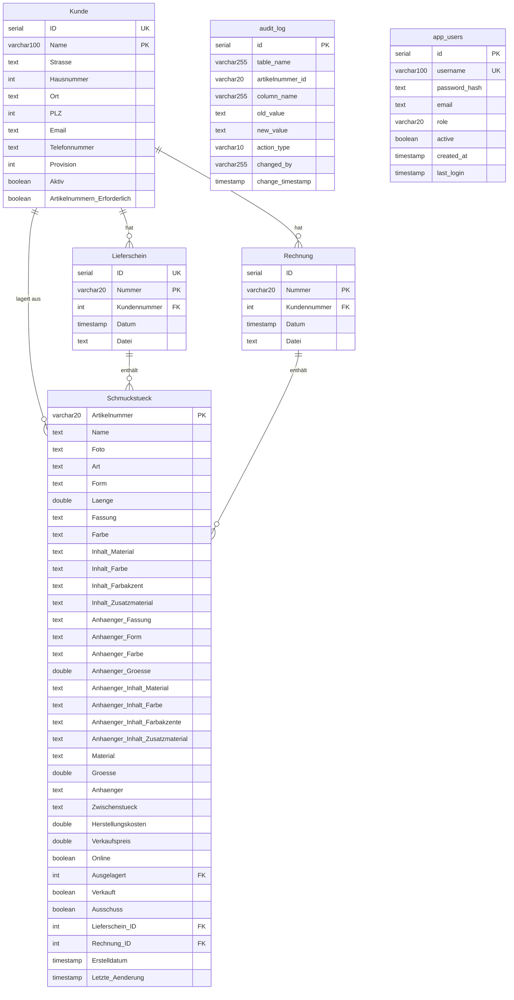

# GitHub Copilot Instructions – GoldRegenDB – Schmuckverwaltung Web-Anwendung

Dieses Dokument beschreibt die Konventionen und wichtigsten Fakten des Projekts, damit GitHub Copilot passende Vorschläge machen kann.

## Projektübersicht

**GoldRegenDB** ist ein Warenwirtschaftssystem für handgefertigten Schmuck (Beton-, Perlen-, Holzschmuck u.a.).
Die Anwendung ist vollständig containerisiert (Docker) und basiert auf PostgreSQL, einem Node.js/Express-Backend und einem React-Frontend.

---

## Datenbankschema

### ER-Diagramm



### Tabellen-Übersicht

| Tabelle        | Beschreibung                    | PK                  | Geschätzter Umfang |
| -------------- | ------------------------------- | ------------------- | ------------------ |
| `Kunde`        | Kunden / Händler / Lagerorte    | `Name` (UK: `ID`)   | ~25 Einträge       |
| `Lieferschein` | Lieferscheine mit Artikellisten | `Nummer` (UK: `ID`) | ~180 Einträge      |
| `Rechnung`     | Rechnungen mit Artikellisten    | `Nummer`            | ~200 Einträge      |
| `Schmuckstück` | Schmuckstücke mit 34 Attributen | `Artikelnummer`     | ~4.000+ Einträge   |
| `audit_log`    | Änderungsprotokoll              | `id`                | ~4.000+ Einträge   |
| `app_users`    | Anwendungsbenutzer              | `id` (UK: `username`) | Wenige Einträge  |

### Beziehungen (Foreign Keys)

- `Lieferschein.Kundennummer` → `Kunde.ID`
- `Rechnung.Kundennummer` → `Kunde.ID`
- `Schmuckstück.Ausgelagert` → `Kunde.ID` (Auslagerung zu Händler)
- `Schmuckstück.Lieferschein_ID` → `Lieferschein.ID`
- `Schmuckstück.Rechnung_ID` → `Rechnung.ID`

### Wichtige Hinweise zum Schema

- `Schmuckstück.Ausgelagert`, `Verkauft`, `Ausschuss`, `Lieferschein_ID`, `Rechnung_ID` haben Standard-Wert `0` (nicht NULL)
- Filter auf "nicht zugeordnet" verwenden `... = 0`
- DB-Indizes: `idx_schmuck_ausgelagert`, `idx_schmuck_lieferschein`, `idx_schmuck_rechnung`

### Geschäftslogik

- **Kunden** sind Einzelhandelspartner (Läden, Online, Messen, Sonderanfertigung)
- **Provision**: variiert pro Kunde (0–40%)
- **Schmuckstücke** haben Suffix-Nummern (z.B. `MBH001_1`, `MBH001_2` = gleicher Typ, verschiedene Exemplare)
- **Artikelnummern-Präfixe**:
  - Erste Stelle (Hersteller):
    - `M` = Marina,
    - `S` = Saskia;
  - Zweite Stelle (Grundmaterial):
    - `A` = "Alkoholtinte",
    - `B` = "Beton",
    - `C` = "Cucio",
    - `E` = "Edelstahl",
    - `F` = "Fimo",
    - `H` = "Harz",
    - `I` = "Phiole",
    - `J` = "Papier",
    - `K` = "Kordel",
    - `L` = "Leder",
    - `M` = "Makramee",
    - `N` = "Naturstein",
    - `P` = "Perle",
    - `S` = "Schrumpffolie",
    - `W` = "Holz",
    - `X` = "3D-Druck"
    - `Y` = "Cabochon"
  - Dritte Stelle (Produktart):
    - `A` = "Armband",
    - `H` = "Halskette",
    - `O` = "Ohrring",
    - `S` = "Schlüsselanhänger",
- **Ausgelagert**: Referenz auf Kunden-ID, bei dem das Stück liegt (0 = im Lager)
- **Verkauft**: boolean, ob verkauft
- **Ausschuss**: boolean, ob aussortiert
- **audit_log**: automatisches Änderungsprotokoll via DB-Trigger (überwacht: Verkauft, Ausgelagert, Ausschuss, Lieferschein_ID, Rechnung_ID, Online)

---

## Technologie-Stack

| Komponente        | Technologie                              |
| ----------------- | ---------------------------------------- |
| **Datenbank**     | PostgreSQL 16                            |
| **Backend**       | Node.js + Express.js (REST API)          |
| **DB-Zugriff**    | `pg` (node-postgres) – kein ORM          |
| **Authentifizierung** | JWT (`jsonwebtoken`) + `bcryptjs`    |
| **Rate Limiting** | `express-rate-limit`                     |
| **Excel-Export**  | `exceljs`                                |
| **Frontend**      | React 19 + Vite + React Router v7        |
| **Container**     | Docker + Docker Compose                  |
| **Dev-Umgebung**  | Docker Compose (dev) mit Hot-Reload      |
| **Produktion**    | Docker Compose (prod) mit Nginx          |

---

## Authentifizierung & Rollen

Die Anwendung nutzt **JWT-basierte Authentifizierung**.

### Rollen

| Rolle   | Seiten / Berechtigungen                                                        |
| ------- | ------------------------------------------------------------------------------ |
| `user`  | Dashboard, Kunden, Schmuckstücke, Lieferscheine, Rechnungen                    |
| `admin` | Alles wie `user` + Audit Log, Debug, Benutzerverwaltung                        |

### Technische Details

- Token-Format: `Bearer <JWT>` im `Authorization`-Header
- Login: `POST /api/auth/login` → gibt JWT zurück
- Token-Validierung: `GET /api/auth/me`
- JWT_SECRET muss als Umgebungsvariable gesetzt sein (Pflicht)
- Rate Limiting: Login max. 20 Versuche / 15 Min; allgemeine API max. 300 Req / Min
- Standard-Admin: Benutzer `admin`, Passwort `admin123` (muss nach erstem Login geändert werden)
- Passwort-Hashing mit `bcryptjs` (10 Rounds)

### Middleware

- `authenticate` – prüft JWT, setzt `req.user`
- `requireAdmin` – prüft `req.user.role === 'admin'`

---

## Projektstruktur

```
GoldRegenDB_Web_new/
├── docker-compose.yml              # Produktion
├── docker-compose.dev.yml          # Entwicklung (Hot Reload)
├── docker-compose.synology.yml     # Synology-NAS-spezifisch
├── .env.example                    # Vorlage für Umgebungsvariablen
├── agent.md                        # Diese Datei
│
├── db/
│   ├── init.sql                    # PostgreSQL-Schema (6 Tabellen + Trigger)
│   ├── seed.sql                    # Initiale Daten
│   ├── backup.sh                   # Backup-Skript (täglich/wöchentlich)
│   ├── restore.sh                  # Wiederherstellungs-Skript
│   ├── load_seed.sh                # Seed-Daten laden
│   ├── convert_mysql_to_pg.py      # Migrations-Hilfsskript
│   └── README.md                   # Backup/Restore-Dokumentation
│
├── backend/
│   ├── Dockerfile                  # Produktions-Image
│   ├── Dockerfile.dev              # Entwicklungs-Image (watch mode)
│   ├── package.json
│   └── src/
│       ├── index.js                # Express Entry-Point
│       ├── config/
│       │   └── db.js               # PostgreSQL-Verbindung (pg Pool)
│       ├── routes/
│       │   ├── auth.js             # Login, /me
│       │   ├── users.js            # Benutzerverwaltung (Admin)
│       │   ├── dashboard.js        # Statistiken
│       │   ├── kunden.js           # Kunden CRUD
│       │   ├── schmuckstuecke.js   # Schmuckstücke CRUD
│       │   ├── lieferscheine.js    # Lieferscheine CRUD
│       │   ├── rechnungen.js       # Rechnungen CRUD
│       │   ├── auditLog.js         # Audit-Log (Admin)
│       │   └── debug.js            # Debug-Endpunkte (Admin)
│       ├── middleware/
│       │   └── auth.js             # JWT-Middleware (authenticate, requireAdmin)
│       └── utils/
│           └── excelService.js     # Excel-Export (generateExcel)
│
├── frontend/
│   ├── Dockerfile                  # Multi-Stage-Build (Node → Nginx)
│   ├── Dockerfile.dev              # Entwicklungs-Image (Vite Dev Server)
│   ├── nginx.conf                  # Nginx-Konfiguration (Produktion)
│   ├── package.json
│   ├── vite.config.js
│   ├── index.html
│   └── src/
│       ├── main.jsx                # React-Einstiegspunkt
│       ├── App.jsx                 # Root-Komponente (Router, Layout, Nav)
│       ├── api.js                  # API-Client (alle Backend-Aufrufe)
│       ├── index.css               # Globale Styles
│       ├── context/
│       │   └── AuthContext.jsx     # Authentifizierungs-Context
│       ├── components/
│       │   └── ProtectedRoute.jsx  # Route-Schutz (adminOnly prop)
│       └── pages/
│           ├── Login.jsx           # Anmeldeseite
│           ├── Dashboard.jsx       # Statistik-Übersicht
│           ├── Schmuckstuecke.jsx  # Schmuckstücke-Verwaltung
│           ├── Kunden.jsx          # Kundenverwaltung
│           ├── Lieferscheine.jsx   # Lieferscheine-Verwaltung
│           ├── Rechnungen.jsx      # Rechnungs-Verwaltung
│           ├── AuditLog.jsx        # Änderungsprotokoll (Admin)
│           ├── Debug.jsx           # Debug-Oberfläche (Admin)
│           └── Benutzerverwaltung.jsx  # Benutzerverwaltung (Admin)
│
├── GoldRegenDB_data.sql            # Original MySQL/MariaDB Datenexport
└── GoldRegenDB_structure.sql       # Original MySQL/MariaDB Struktur-Dump
```

---

## API-Endpunkte

### Authentifizierung (öffentlich)

| Methode | Pfad              | Beschreibung                    |
| ------- | ----------------- | ------------------------------- |
| POST    | `/api/auth/login` | Login, gibt JWT zurück          |
| GET     | `/api/auth/me`    | Eigene Benutzerdaten aus Token  |

### Allgemein (authentifiziert)

| Methode | Pfad                    | Beschreibung                           |
| ------- | ----------------------- | -------------------------------------- |
| GET     | `/api/health`           | Health-Check (öffentlich)              |
| GET     | `/api/dashboard`        | Statistiken (Bestände, Umsatz etc.)    |
| GET/POST/PUT/DELETE | `/api/kunden` | Kunden CRUD                   |
| GET/POST/PUT/DELETE | `/api/schmuckstuecke` | Schmuckstücke CRUD       |
| GET/POST/PUT/DELETE | `/api/lieferscheine` | Lieferscheine CRUD        |
| GET/POST/PUT/DELETE | `/api/rechnungen` | Rechnungen CRUD              |

### Admin-Only

| Methode | Pfad              | Beschreibung                           |
| ------- | ----------------- | -------------------------------------- |
| GET     | `/api/audit-log`  | Änderungsprotokoll anzeigen            |
| GET/POST/PUT/DELETE | `/api/users` | Benutzerverwaltung              |
| GET     | `/api/debug`      | Debug-Informationen                    |

---

## Docker-Architektur

### Ports

| Service   | Entwicklung | Produktion |
| --------- | ----------- | ---------- |
| Frontend  | 5173        | 3000 (→ Nginx :80) |
| Backend   | 3001        | 3001       |
| Datenbank | 5432        | 5432       |

### Services (Produktion)

```yaml
services:
  db:
    image: postgres:16-alpine
    restart: unless-stopped
    volumes:
      - pgdata:/var/lib/postgresql/data
      - pgbackups:/backups
      - ./db/init.sql:/docker-entrypoint-initdb.d/01-init.sql
      - ./db/seed.sql:/docker-entrypoint-initdb.d/02-seed.sql
    ports:
      - "5432:5432"
    healthcheck:
      test: ["CMD-SHELL", "pg_isready -U ${POSTGRES_USER} -d ${POSTGRES_DB}"]
      interval: 5s
      retries: 5

  backend:
    build: ./backend
    restart: unless-stopped
    depends_on:
      db:
        condition: service_healthy
    environment:
      DATABASE_URL: ${DATABASE_URL}
      NODE_ENV: production
      PORT: ${PORT}
      JWT_SECRET: ${JWT_SECRET}
    ports:
      - "${PORT}:${PORT}"

  frontend:
    build: ./frontend         # Multi-Stage: Node build → Nginx
    restart: unless-stopped
    ports:
      - "3000:80"             # Nginx serviert den gebautem React-Build
```

### Dev-Modus

- Hot-Reload für Frontend (Vite) und Backend (node --watch)
- Source-Volumes gemounted
- `docker compose -f docker-compose.dev.yml up --build`

---

## Excel-Export

Die Funktion `generateExcel(type, data, logoPath?)` in `backend/src/utils/excelService.js` erzeugt Excel-Dateien für verschiedene Datentypen. Standard-Logo: `backend/src/assets/Logo trasparent weißer Kreis.png`.

---

## MySQL → PostgreSQL Migration

### Wichtige Umstellungen

| MySQL/MariaDB                     | PostgreSQL                                   |
| --------------------------------- | -------------------------------------------- |
| `int(11) NOT NULL AUTO_INCREMENT` | `SERIAL` oder `GENERATED ALWAYS AS IDENTITY` |
| `` `backticks` ``                 | `"double_quotes"` oder keine Quotes          |
| `tinyint(1)`                      | `BOOLEAN`                                    |
| `double`                          | `DOUBLE PRECISION`                           |
| `current_timestamp()`             | `CURRENT_TIMESTAMP`                          |
| `ON UPDATE current_timestamp()`   | Trigger-Funktion                             |
| `ENGINE=InnoDB`                   | entfällt                                     |
| `COLLATE=utf8mb3_general_ci`      | `ENCODING 'UTF8'`                            |
| `/*!40101 ... */` Kommentare      | entfällt                                     |
| Umlaute in Tabellen-/Spaltennamen | In Anführungszeichen (`"Schmuckstück"`)      |

### Trigger

**`trg_update_letzte_aenderung`** – aktualisiert `Letzte_Änderung` bei jedem UPDATE auf `Schmuckstück`.

**`trg_audit_schmuckstueck`** – schreibt Änderungen an Verkauft, Ausgelagert, Ausschuss, Lieferschein_ID, Rechnung_ID, Online in `audit_log`.

---

## Entwicklungs-Workflow

```bash
# Entwicklung starten (Hot-Reload)
docker compose -f docker-compose.dev.yml up --build

# Frontend: http://localhost:5173
# Backend API: http://localhost:3001/api
# Datenbank: localhost:5432

# Produktion starten
docker compose up --build -d

# Frontend: http://localhost:3000
# Backend API: http://localhost:3001/api
```

### Build & Lint

```bash
# Frontend bauen
cd frontend && npm run build

# Frontend linten
cd frontend && npm run lint

# Backend-Syntax prüfen
node --check backend/src/index.js
```

### Umgebungsvariablen (`.env`)

```
DB_PASSWORD=changeme
POSTGRES_DB=goldregendb
POSTGRES_USER=goldregen
NODE_ENV=development
PORT=3001
DATABASE_URL=postgresql://goldregen:changeme@db:5432/goldregendb
JWT_SECRET=change-this-to-a-long-random-secret
VITE_API_URL=http://localhost:3001/api
```

---

## Implementierte Features

### Phase 1: CRUD-Grundfunktionen ✅

- [x] Dashboard mit Statistiken (Gesamtbestand, ausgelagert, verkauft, Umsatz)
- [x] Schmuckstücke: Liste, Filter, Suche, Erstellen, Bearbeiten
- [x] Kunden: Liste, Erstellen, Bearbeiten, Detailansicht mit zugehörigen Stücken
- [x] Lieferscheine: Liste, Erstellen (mit Artikelzuordnung)
- [x] Rechnungen: Liste, Erstellen (mit Artikelzuordnung)
- [x] Audit-Log: Anzeige der letzten Änderungen (Admin)

### Phase 2: Erweiterte Features ✅ (teilweise)

- [x] Export-Funktionen (Excel via exceljs)
- [ ] Foto-Upload für Schmuckstücke (statt Netzwerk-Pfaden)
- [ ] PDF-Generierung für Lieferscheine und Rechnungen
- [ ] Barcode-/QR-Code-Scanner für Artikelnummern
- [ ] Filterable Bestandsübersicht pro Kunde

### Phase 3: Fortgeschritten ✅ (teilweise)

- [x] Benutzer-Authentifizierung (JWT) und Rollenverwaltung (admin/user)
- [x] Benutzerverwaltung über UI
- [ ] Multi-Mandanten-Fähigkeit
- [ ] Statistik-Dashboard mit Diagrammen
- [ ] Automatische E-Mail-Benachrichtigungen

---

## SQL-Quelldateien

- `GoldRegenDB_structure.sql` — Original MySQL/MariaDB Tabellenstruktur
- `GoldRegenDB_data.sql` — Original Datenexport (~3.2 MB, ~12.400 Zeilen)
