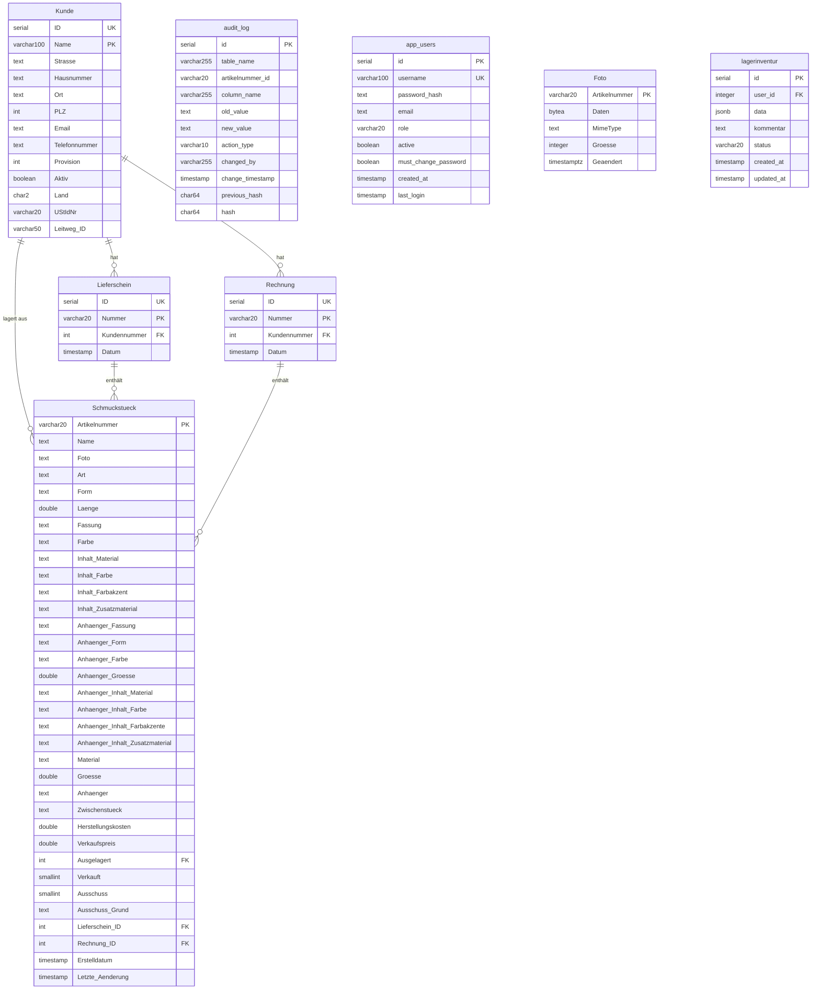

# GoldRegenDB – Schmuckverwaltung Web-Anwendung

## Projektübersicht

**GoldRegenDB** ist ein Warenwirtschaftssystem für handgefertigten Schmuck (Beton-, Perlen-, Holzschmuck u.a.).
Die Anwendung ist vollständig containerisiert (Docker) und basiert auf PostgreSQL, einem Node.js/Express-Backend und einem React-Frontend.

---

## Datenbankschema

### ER-Diagramm



### Tabellen-Übersicht

| Tabelle        | Beschreibung                    | PK                  | Geschätzter Umfang |
| -------------- | ------------------------------- | ------------------- | ------------------ |
| `Kunde`        | Kunden / Händler / Lagerorte    | `Name` (UK: `ID`)   | ~25 Einträge       |
| `Lieferschein` | Lieferscheine mit Artikellisten | `Nummer` (UK: `ID`) | ~180 Einträge      |
| `Rechnung`     | Rechnungen mit Artikellisten    | `Nummer`            | ~200 Einträge      |
| `Schmuckstück` | Schmuckstücke mit 34 Attributen | `Artikelnummer`     | ~4.000+ Einträge   |
| `audit_log`    | Änderungsprotokoll              | `id`                | ~4.000+ Einträge   |
| `app_users`    | Anwendungsbenutzer              | `id` (UK: `username`) | Wenige Einträge  |
| `lagerinventur` | Lager-Inventur-Entwürfe (gezählte Stückzahlen pro Benutzer) | `id` | Wenige Einträge |
| `Foto`         | Bilddaten der Schmuckstück-Fotos | `Artikelnummer` (Basisnummer) | ein Foto je Basis-Artikelnummer |
| `bestellung_foto` | Referenzfotos aus dem Bestellformular | `datei_name` (= `bestellung.foto_pfad`) | wenige |

### Beziehungen (Foreign Keys)

- `Lieferschein.Kundennummer` → `Kunde.ID`
- `Rechnung.Kundennummer` → `Kunde.ID`
- `Schmuckstück.Ausgelagert` → `Kunde.ID` (Auslagerung zu Händler)
- `Schmuckstück.Lieferschein_ID` → `Lieferschein.ID`
- `Schmuckstück.Rechnung_ID` → `Rechnung.ID`

### Wichtige Hinweise zum Schema

- `Schmuckstück.Ausgelagert`, `Verkauft`, `Ausschuss`, `Lieferschein_ID`, `Rechnung_ID` haben Standard-Wert `0` (nicht NULL)
- Filter auf "nicht zugeordnet" verwenden `... = 0`
- DB-Indizes: `idx_schmuck_ausgelagert`, `idx_schmuck_lieferschein`, `idx_schmuck_rechnung`

### Geschäftslogik

- **Kunden** sind Einzelhandelspartner (Läden, Online, Messen, Sonderanfertigung)
- **Provision**: variiert pro Kunde (0–40%)
- **E-Rechnung** (EN 16931, `backend/src/utils/eRechnung/`, Doku: `docs/E-RECHNUNG.md`): XRechnung 3.0 (CII-XML)
  und ZUGFeRD 2/Factur-X (PDF/A-3, Profil EN 16931). Gesamtrabatt und Provision werden als Nachlässe auf
  Dokumentebene (BG-20) abgebildet, Umsatzsteuer als Kategorie `E` (Kleinunternehmer § 19 UStG). Verkäuferdaten
  kommen aus `VERKAEUFER_*`-Umgebungsvariablen (`utils/eRechnung/verkaeufer.js`, auch vom Excel-Export genutzt),
  Kundenfelder `Land`/`UStIdNr`/`Leitweg_ID` aus `Kunde`. Vor jeder Auslieferung prüft `validator.js` das XML
  offline gegen XSD + Schematron (EN 16931, XRechnung) – dieselben Artefakte wie der KoSIT-Validator.
- **Schmuckstücke** haben Suffix-Nummern (z.B. `MBH001_1`, `MBH001_2` = gleicher Typ, verschiedene Exemplare)
- **Artikelnummern-Präfixe**:
  - Erste Stelle (Hersteller):
    - `M` = Marina,
    - `S` = Saskia;
  - Zweite Stelle (Grundmaterial):
    - `A` = "Alkoholtinte",
    - `B` = "Beton",
    - `C` = "Cucio",
    - `E` = "Edelstahl",
    - `F` = "Fimo",
    - `H` = "Harz",
    - `I` = "Phiole",
    - `J` = "Papier",
    - `K` = "Kordel",
    - `L` = "Leder",
    - `M` = "Makramee",
    - `N` = "Naturstein",
    - `P` = "Perle",
    - `S` = "Schrumpffolie",
    - `W` = "Holz",
    - `X` = "3D-Druck"
    - `Y` = "Cabochon"
  - Dritte Stelle (Produktart):
    - `A` = "Armband",
    - `H` = "Halskette",
    - `O` = "Ohrring",
    - `S` = "Schlüsselanhänger",
- **Ausgelagert**: Referenz auf Kunden-ID, bei dem das Stück liegt (0 = im Lager)
- **Verkauft**: SMALLINT (0 = nicht verkauft, 1 = verkauft)
- **Ausschuss**: SMALLINT (0 = kein Ausschuss, 1 = aussortiert); bei Ausschuss=1 muss `Ausschuss_Grund` gesetzt sein
- **audit_log**: automatisches Änderungsprotokoll via DB-Trigger (überwacht: Verkauft, Ausgelagert, Ausschuss, Ausschuss_Grund, Lieferschein_ID, Rechnung_ID)
- **audit_log Tamper-Schutz** (Issue #139): `trg_audit_log_immutable` blockiert jedes UPDATE/DELETE auf `audit_log`; `trg_audit_log_hash_chain` verkettet jede Zeile per SHA-256 mit dem Hash der Vorgängerzeile (`previous_hash`/`hash`). Kette prüfen: `SELECT * FROM verify_audit_chain();` oder `GET /api/audit-log/verify` (admin). Details siehe `db/README.md`
- **Foto / bestellung_foto** (Issue #208): Bilddaten als BYTEA in der Datenbank statt als Datei in `backend/src/assets/uploads/`. Eigene Tabellen, damit `SELECT *` auf `"Schmuckstück"` keine Bilddaten lädt. Schlüssel von `"Foto"` ist die **Basis-Artikelnummer** (`MHO123` gilt für `MHO123_1`, `MHO123_2`, …), deshalb kein FK auf `"Schmuckstück"`. Zugriff nur über `backend/src/utils/fotoService.js`. Die Spalte `"Schmuckstück"."Foto"` enthält nur noch den Verweis (Basisnummer bzw. alter Dateiname) und entfällt in einem Folge-Schritt
- **lagerinventur**: speichert Inventur-Entwürfe pro Benutzer; `data` ist JSONB (`{ [artikelnummer]: anzahl }`); `status` ist `entwurf` oder `abgeschlossen`; FK auf `app_users.id`; Index auf `(user_id, status)`; wird via `db.js`-Startup-Migration angelegt
## WHERE Clause Builder (PFLICHT!)

**WICHTIG:** Für alle Datenbank-Queries, die Schmuckstücke filtern, **MUSS** der zentrale WHERE-Builder verwendet werden!

### Geschäftsregeln (konsistent in gesamter Codebasis!)

| Status | Regel | Code |
|--------|-------|------|
| **Verkauft** | `Verkauft = 1 UND Ausschuss = 0` | `builder.verkauft()` |
| **Ausschuss** | `Ausschuss = 1` | `builder.ausschuss()` |
| **Verfügbar** | `Verkauft = 0 UND Ausschuss = 0 UND Ausgelagert = 0` | `builder.verfuegbar()` |
| **Aktiv Ausgelagert** | `Ausgelagert > 0 UND Verkauft = 0 UND Ausschuss = 0` | `builder.aktivAusgelagert(kundeId?)` |

**⚠️ Verkauft ≠ Ausschuss** — Ein Schmuckstück kann niemals gleichzeitig verkauft UND Ausschuss sein!

### Verwendung

```javascript
const { where } = require('../utils/whereClauseBuilder');

// Einfaches Beispiel
const builder = where();
builder.verfuegbar();
const { rows } = await db.query(
  `SELECT * FROM "Schmuckstück" ${builder.build()}`,
  builder.getParams()
);

// Kombiniert
const builder = where();
builder.aktivAusgelagert(5);  // Bei Kunde 5
builder.grundmaterial('P');   // Perlen
builder.produktart('A');      // Armband
const query = `SELECT * FROM "Schmuckstück" ${builder.build()}`;
const result = await db.query(query, builder.getParams());
```

> **Signatur:** `where(startParamIdx = 1, tenantId = null)` – `tenantId` ist für zukünftige Multi-Mandanten-Unterstützung vorgesehen und fügt automatisch eine `tenant_id`-Bedingung ein, wenn ein Wert übergeben wird.

**📖 Vollständige Dokumentation:** [`backend/src/utils/WHERE_BUILDER.md`](../backend/src/utils/WHERE_BUILDER.md)

**✅ Migrierte Routes:** dashboard.js, schmuckstuecke.js, sumup.js, kunden.js, inventur.js
**⏳ Noch zu migrieren:** lieferscheine.js, rechnungen.js

---


---

## Technologie-Stack

| Komponente        | Technologie                              |
| ----------------- | ---------------------------------------- |
| **Datenbank**     | PostgreSQL 16                            |
| **Backend**       | Node.js + Express.js (REST API)          |
| **DB-Zugriff**    | `pg` (node-postgres) – kein ORM          |
| **Authentifizierung** | JWT (`jsonwebtoken`) + `bcryptjs`    |
| **Rate Limiting** | `express-rate-limit`                     |
| **Security-Header** | `helmet`                               |
| **Input-Validierung** | `zod`                                |
| **Excel-Export**  | `exceljs`                                |
| **E-Rechnung**    | `pdf-lib` + `@pdf-lib/fontkit` (PDF/A-3), `xmllint-wasm` (XSD), `saxon-js` (Schematron) |
| **Bild-Validierung** | `image-size`                          |
| **Icons**         | Font Awesome (`@fortawesome/react-fontawesome`, `free-solid-svg-icons`, `free-regular-svg-icons`) |
| **Frontend**      | React 19 + Vite + React Router v7        |
| **Container**     | Docker + Docker Compose                  |
| **Dev-Umgebung**  | Nativ (npm Workspaces + `concurrently`) oder Docker Compose (dev) mit Hot-Reload |
| **Produktion**    | Docker Compose (prod), ein Single-Image, kein Nginx |
| **Backend-Tests** | Jest (`npm test` in `backend/`)          |
| **Frontend-Tests** | Vitest (`npm test` in `frontend/`)      |
| **CI**            | GitHub Actions (`.github/workflows/tests.yml`) |

---

## Authentifizierung & Rollen

Die Anwendung nutzt **JWT-basierte Authentifizierung**.

### Rollen

| Rolle        | Seiten / Berechtigungen                                                                      |
| ------------ | -------------------------------------------------------------------------------------------- |
| `user`       | Schmuckstücke erstellen (nur POST /api/schmuckstuecke)                                       |
| `bearbeiter` | Dashboard, Kunden, Schmuckstücke, Lieferscheine, Rechnungen, SumUp, Inventur, Lager-Inventur |
| `admin`      | Alles wie `bearbeiter` + Audit Log, Debug, Benutzerverwaltung, Datensicherung                |

### Technische Details

- Token-Transport: **httpOnly-Cookie `jwt`** (Standard). `Bearer <JWT>` im
  `Authorization`-Header bleibt als Fallback für Skripte und E2E-Tests
- Login: `POST /api/auth/login` → setzt das `jwt`-Cookie (und gibt das Token für API-Clients zusätzlich im Body zurück)
- Logout: `POST /api/auth/logout` → löscht das Cookie
- Token-Validierung: `GET /api/auth/me`
- Passwort ändern: `PUT /api/auth/change-password`
- JWT_SECRET muss gesetzt sein (Pflicht) – via Env-Var oder `JWT_SECRET_FILE` (Docker-Secret), siehe `backend/src/config/secrets.js`. Graceful Rollover über `JWT_SECRET_OLD`: `authenticate()` akzeptiert beim Verifizieren zusätzlich das alte Secret, signiert wird immer mit dem neuen (siehe README „Secrets rotieren“)
- Rate Limiting: nur noch für unauthentifizierte Endpunkte – Login/Passwort-Reset
  max. 20 **fehlgeschlagene** Versuche / 15 Min pro IP, öffentliches Bestellformular
  max. 10 / 15 Min. Die angemeldete Anwendung läuft ohne Limit: eine Tabellenseite
  löst pro Zeile einen Foto-Request aus, jedes Limit schlug im Normalbetrieb zu
- `TRUST_PROXY` setzen (z. B. `1`), wenn ein Reverse Proxy davor steht – sonst
  teilen sich alle Benutzer die Login-Quote einer einzigen IP
- Standard-Admin: Benutzer `admin`, Passwort `admin` (muss nach erstem Login geändert werden, `must_change_password = TRUE`)
- Passwort-Hashing: Das Frontend sendet das Passwort im **Klartext** (über TLS); ausschließlich das Backend hasht und vergleicht mit `bcryptjs` (10 Rounds) – siehe `backend/src/utils/passwordService.js`
- Mindestlänge für **neu gesetzte** Passwörter: 8 Zeichen. Beim Login gilt keine Mindestlänge, damit Altkonten sich weiterhin anmelden können
- Account-Lockout: nach 5 aufeinanderfolgenden Fehlversuchen wird das Konto 30 Minuten gesperrt (`failed_login_attempts` / `locked_until`)
- Passwort-Reset: `POST /api/auth/forgot-password` → `POST /api/auth/reset-password` mit Token

### Middleware

- `authenticate` – prüft JWT, setzt `req.user`, konfiguriert DB-Session-User für Audit-Trigger
- `requireAdmin` – prüft `req.user.role === 'admin'`
- `requireBearbeiter` – prüft `req.user.role` ist `'admin'` oder `'bearbeiter'`

---

## Input-Validierung (PFLICHT bei schreibenden Routen!)

Jede Route, die Daten entgegennimmt, validiert den Request-Body mit einem
Zod-Schema. Ohne Schema gelangen unbekannte Felder und ungeprüfte Typen in die
SQL-Statements.

```javascript
const { validate } = require('../middleware/validate');
const { kundeSchema } = require('../schemas');

router.post('/', validate(kundeSchema), async (req, res) => {
  // req.body enthält jetzt ausschließlich geprüfte, typkorrekte Felder
});
```

- Schemas liegen in `backend/src/schemas/index.js`, wiederverwendbare Bausteine
  (`text`, `zahl`, `ganzzahl`, `bool`, `sha256`, `artikelnummer`) in `common.js`.
- **Unbekannte Felder werden entfernt** – Zod-Objekte strippen sie standardmäßig.
- Leere Formular-Strings werden zu `null`, Zahlen-Strings (`"49.90"`) zu Zahlen.
  Das ist nötig, weil HTML-Formulare alles als String senden.
- Bei Verstoß: `400` mit `{ error, details }`, wobei `error` das erste
  fehlerhafte Feld benennt (`"Provision: darf nicht größer als 100 sein"`).
- Verstöße landen als `logger.warn('VALIDATION', …)` im Log.

**Neue schreibende Route anlegen:** Schema in `schemas/index.js` ergänzen,
exportieren, per `validate(...)` vor den Handler hängen und einen Test in
`backend/__tests__/validation.test.js` ergänzen – dort wird bewusst auch der
Gutfall mit dem echten Frontend-Payload geprüft, damit die Schemas nicht zu
streng werden.

---

## CORS (`backend/src/middleware/cors.js`)

Die API ist nur für explizit erlaubte Origins geöffnet. Konfiguriert wird das
über die kommaseparierte Umgebungsvariable `ALLOWED_ORIGINS`:

```
ALLOWED_ORIGINS=http://localhost:5173,https://schmuck.example.com
```

- Ohne gesetzte Variable gelten die lokalen Dev-Origins
  (`localhost:5173` / `localhost:3000`, jeweils auch als `127.0.0.1`).
- Requests **ohne** `Origin`-Header (same-origin, `curl`, Container-Healthcheck)
  werden immer durchgelassen.
- In Produktion liefert Express das Frontend selbst aus – diese Requests sind
  same-origin und lösen gar keine CORS-Prüfung aus. `ALLOWED_ORIGINS` muss dort
  nur gesetzt werden, wenn das Frontend von einer anderen Adresse geladen wird.
- Abgelehnte Origins werden mit `logger.warn('CORS', …)` protokolliert.
- `Content-Disposition` und `X-Upload-File-Count` sind als Response-Header
  freigegeben, weil `api.js` sie bei Downloads ausliest.

---

## Security-Header (`backend/src/middleware/securityHeaders.js`)

`helmet` wird als erste Middleware in `index.js` registriert und setzt u. a.
`X-Content-Type-Options` und `X-Frame-Options`.

Die Content-Security-Policy ist an das ausgelieferte Frontend angepasst:

| Direktive     | Wert / Grund                                                                 |
| ------------- | ---------------------------------------------------------------------------- |
| `style-src`   | `'unsafe-inline'` + `fonts.googleapis.com` – React-`style`-Props, Font-Import |
| `font-src`    | `data:` + `fonts.gstatic.com`                                                 |
| `img-src`     | `data:` + `blob:` – Fotos werden als Data-URL geladen (`api.js`)             |
| `frame-ancestors` | `'none'` – Clickjacking-Schutz                                            |
| `upgrade-insecure-requests` | nur mit `FORCE_HTTPS=true` aktiv (Issue #138, siehe unten)      |

`crossOriginResourcePolicy` steht auf `cross-origin`, damit der Vite-Dev-Server
(Port 5173) Fotos und Excel-Downloads vom Backend (Port 3001) laden kann.

Die CSP greift nur für Dokumente, die Express selbst ausliefert (Produktions-Image).
Im nativen Dev-Modus liefert Vite das HTML aus – dort gilt sie nicht.

### TLS / HTTPS (Issue #138)

Express terminiert kein TLS selbst – das übernimmt ein vorgeschalteter Reverse
Proxy (Synology Reverse Proxy, `docker-compose.proxy.yml` mit Caddy, o. Ä.). Drei
Env-Variablen steuern, wie das Backend darauf reagiert (siehe `.env.example`):

| Variable        | Wirkung                                                                  |
| --------------- | ------------------------------------------------------------------------- |
| `TRUST_PROXY`   | `app.set('trust proxy', …)` – Anzahl vertrauenswürdiger Hops davor. Nötig, damit Express `X-Forwarded-*`-Header nur vom echten Proxy akzeptiert, nicht von jedem Client |
| `FORCE_HTTPS`   | Aktiviert `backend/src/middleware/httpsRedirect.js` (301 auf https, nur wenn der Proxy `X-Forwarded-Proto: http` meldet – fehlt der Header, z. B. beim Docker-Healthcheck direkt gegen den Container, wird nicht umgeleitet) sowie HSTS und `upgrade-insecure-requests` in `securityHeaders.js` |
| `HSTS_MAX_AGE`  | Gültigkeitsdauer des HSTS-Headers in Sekunden (Standard 15552000 = 180 Tage), nur mit `FORCE_HTTPS=true` relevant |

Alle drei sind standardmäßig aus/leer – native Entwicklung (`npm run dev`,
`docker-compose.dev.yml`) hat keinen TLS-terminierenden Proxy davor und darf davon
nicht betroffen sein. In `index.js` warnt eine Startmeldung (`logger.warn`), wenn
`NODE_ENV=production` läuft, aber weder `FORCE_HTTPS` noch `COOKIE_SECURE` gesetzt
ist – kein harter Fehler, damit bestehende Deployments nicht abstürzen.

Deployment-Optionen: siehe README.md, Abschnitt "HTTPS auf Synology".

---

## Projektstruktur

```
GoldRegenDB_Web/
├── Dockerfile                       # Produktions-Image (Multi-Stage: Frontend-Build → Express, kein Nginx)
├── .dockerignore
├── package.json                     # Root npm Workspace (backend, frontend) + `npm run dev` (concurrently)
├── docker-compose.yml               # Produktion (ein `app`-Service)
├── docker-compose.dev.yml           # Entwicklung, voll containerisiert (Alternative zu nativem `npm run dev`)
├── docker-compose.synology.yml      # Synology-NAS-spezifisch
├── docker-compose.proxy.yml         # Overlay: Caddy-Reverse-Proxy mit TLS (Issue #138)
├── proxy/Caddyfile                  # Caddy-Konfiguration für docker-compose.proxy.yml
├── .env.example                     # Vorlage für Umgebungsvariablen
├── .github/
│   ├── copilot-instructions.md     # Diese Datei
│   └── workflows/
│       ├── tests.yml               # CI: Backend (Jest) + Frontend (Vitest) bei jedem PR
│       ├── check-copilot-instructions.yml  # CI: Prüft ob copilot-instructions.md aktuell ist
│       └── release.yml             # CI: Release-Workflow
├── GoldRegenDB.sql                 # Vollständiger PostgreSQL-Dump (Struktur + Daten)
├── GoldRegenDB_data.sql            # Original MySQL/MariaDB Datenexport
├── GoldRegenDB_structure.sql       # Original MySQL/MariaDB Struktur-Dump
│
├── scripts/
│   └── synology-update.sh          # Update-Skript für Synology-NAS-Deployment
│
├── db/
│   ├── init.sql                    # PostgreSQL-Schema (6 Tabellen + Trigger)
│   ├── seed.sql                    # Initiale Daten
│   ├── backup.sh                   # Backup-Skript (täglich/wöchentlich)
│   ├── restore.sh                  # Wiederherstellungs-Skript
│   ├── load_seed.sh                # Seed-Daten laden
│   ├── convert_mysql_to_pg.py      # Migrations-Hilfsskript (MySQL → PostgreSQL)
│   ├── json_to_sql.py              # Konvertiert JSON-Backup in SQL-Statements
│   └── README.md                   # Backup/Restore-Dokumentation
│
├── backend/
│   ├── Dockerfile.dev               # Entwicklungs-Image (watch mode, für docker-compose.dev.yml)
│   ├── package.json
│   ├── __tests__/                  # Jest-Tests
│   │   ├── auth.middleware.test.js
│   │   ├── auth.routes.test.js
│   │   ├── users.routes.test.js
│   │   ├── lagerinventur.routes.test.js
│   │   ├── schmuckstuecke.utils.test.js
│   │   ├── sumup.utils.test.js
│   │   ├── whereClauseBuilder.test.js
│   │   └── logger.test.js
│   ├── scripts/
│   │   └── dev-start.sh            # Startskript für Entwicklungs-Container
│   └── src/
│       ├── index.js                # Express Entry-Point
│       ├── config/
│       │   └── db.js               # PostgreSQL-Verbindung (pg Pool, request-scoped client, Startup-Migrationen)
│       ├── routes/
│       │   ├── auth.js             # Login, /me, Passwort ändern
│       │   ├── users.js            # Benutzerverwaltung (Admin)
│       │   ├── dashboard.js        # Statistiken
│       │   ├── kunden.js           # Kunden CRUD + Rücklagern
│       │   ├── schmuckstuecke.js   # Schmuckstücke CRUD + Foto-Upload + Filter-Optionen
│       │   ├── lieferscheine.js    # Lieferscheine CRUD + Excel-Export
│       │   ├── rechnungen.js       # Rechnungen CRUD + Excel-Export + E-Rechnung (XRechnung/ZUGFeRD)
│       │   ├── sumup.js            # SumUp CSV Import/Export
│       │   ├── inventur.js         # Inventurübersicht pro Kunde + Excel-Export
│       │   ├── lagerinventur.js    # Lager-Inventur-Entwürfe CRUD + Diff-Auswertung (bearbeiter)
│       │   ├── lagerinventur.md    # API-Dokumentation für Lager-Inventur-Endpunkte
│       │   ├── backup.js           # Datensicherung Export/Import (Admin)
│       │   ├── auditLog.js         # Audit-Log (Admin)
│       │   └── debug.js            # Debug-Endpunkte (Admin)
│       ├── middleware/
│       │   └── auth.js             # JWT-Middleware (authenticate, requireAdmin, requireBearbeiter)
│       └── utils/
│           ├── excelService.js     # Excel-Export (generateExcel, generateInventurExcel)
│           ├── artikelBezeichnung.js  # Positionstexte/Kategorie für Excel und E-Rechnung
│           ├── eRechnung/          # EN 16931: modell.js (DB → BT-Modell, Pflichtfelder), cii.js (XML),
│           │                       #   validator.js (XSD + Schematron), zugferdPdf.js (PDF/A-3), verkaeufer.js
│           ├── fotoService.js      # Fotos in der DB (Tabellen Foto, bestellung_foto): Magic Bytes, Upsert, ETag
│           ├── whereClauseBuilder.js  # WHERE-Clause-Builder für konsistente Schmuckstück-Queries
│           ├── WHERE_BUILDER.md    # Dokumentation des WHERE-Clause-Builders
│           └── logger.js           # Strukturiertes Logging mit Zeitstempel und Komponenten-Prefix
│
├── frontend/
│   ├── Dockerfile.dev               # Entwicklungs-Image (Vite Dev Server, für docker-compose.dev.yml)
│   ├── package.json
│   ├── vite.config.js
│   ├── index.html
│   └── src/
│       ├── main.jsx                # React-Einstiegspunkt
│       ├── App.jsx                 # Root-Komponente (Router, Layout, Nav)
│       ├── api.js                  # API-Client (alle Backend-Aufrufe)
│       ├── index.css               # Globale Styles
│       ├── context/
│       │   └── AuthContext.jsx     # Authentifizierungs-Context
│       ├── components/
│       │   ├── DataTable.jsx       # Generische sortierbare Tabellen-Komponente (wiederverwendbar)
│       │   ├── TableToolbar.jsx    # Toolbar-Komponente für Tabellen (Suche, Filter, Aktionen)
│       │   ├── PhotoUpload.jsx     # Foto-Upload (Drag & Drop + Preview)
│       │   └── ProtectedRoute.jsx  # Route-Schutz (adminOnly / bearbeiterOnly props)
│       ├── __tests__/              # Vitest-Tests
│       │   └── authApi.test.js      # Passwort-Aufrufe von api.js (Klartext-Übertragung)
│       └── pages/
│           ├── Login.jsx           # Anmeldeseite
│           ├── Dashboard.jsx       # Statistik-Übersicht
│           ├── Schmuckstuecke.jsx  # Schmuckstücke-Verwaltung
│           ├── Kunden.jsx          # Kundenverwaltung
│           ├── DocumentManager.jsx # Gemeinsame Komponente für Lieferscheine & Rechnungen (zentraler Reuse)
│           ├── Lieferscheine.jsx   # Lieferscheine-Verwaltung (nutzt DocumentManager)
│           ├── Rechnungen.jsx      # Rechnungs-Verwaltung (nutzt DocumentManager)
│           ├── Sumup.jsx           # SumUp CSV-Import/-Export
│           ├── Inventur.jsx        # Inventurübersicht pro Kunde + Lager-Inventur-Entwürfe (bearbeiter; Tabs: Kunden/Lager)
│           ├── AuditLog.jsx        # Änderungsprotokoll (Admin)
│           ├── Debug.jsx           # Debug-Oberfläche (Admin)
│           ├── Benutzerverwaltung.jsx  # Benutzerverwaltung (Admin)
│           └── Datensicherung.jsx  # Backup & Restore (Admin)
```

---

## Frontend Styling Guidelines

### ⚠️ STRIKTE REGEL: KEINE INLINE STYLES

**VERBOTEN:** Inline `style` Props in React-Komponenten
```jsx
// ❌ NICHT ERLAUBT
<div style={{ marginTop: 24, display: "flex", gap: 8 }}>
<button style={{ width: 70, color: "red" }}>
<span style={{ marginLeft: "auto" }}>
```

**ERLAUBT:** CSS-Klassen mit `className` in der globalen `index.css`
```jsx
// ✅ ERLAUBT
<div className="my-container">
<button className="form-input-small">
<span className="ml-auto">
```

### Grund
- Alle Styles sind zentral in [`frontend/src/index.css`](../frontend/src/index.css) definiert
- Klassen-basierte Styles ermöglichen konsistentes Design und einfacheres Refactoring
- Keine Vermischung von Stil-Logik und Component-Logik

### Prozess beim Styling

1. **Neue Styles brauchen?** → Klasse in `index.css` definieren
2. **Dokumentation:** Aussagekräftige Klassenname wählen (z.B. `.piece-container`, `.detail-value-warning`, `.rabatt-input`)
3. **Anwendung:** `className="neue-klasse"` verwenden
4. **Falls mehrere Klassen nötig:** Template Strings oder `classnames` Util (falls vorhanden)

### Bestehende Utility-Klassen (Beispiele)

Häufig benötigte Styles sind bereits definiert:
- `.ml-auto` → `margin-left: auto`
- `.mr-8` → `margin-right: 8px`
- `.cursor-pointer` → `cursor: pointer`
- `.modal-lg` → Modal mit erhöhter Größe
- `.btn-primary`, `.btn-secondary`, `.btn-danger` → Button-Varianten
- `.badge`, `.badge.success`, `.badge.warning` → Badge-Styles

Siehe vollständige Liste in `index.css` (Abschnitt "DOCUMENTMANAGER STYLES" und überall)

---

## API-Endpunkte

### Authentifizierung (öffentlich)

| Methode | Pfad              | Beschreibung                    |
| ------- | ----------------- | ------------------------------- |
| POST    | `/api/auth/login` | Login, gibt JWT zurück          |
| GET     | `/api/auth/me`    | Eigene Benutzerdaten aus Token  |
| POST    | `/api/auth/logout` | Auth-Cookie löschen             |
| GET     | `/api/csrf-token`  | CSRF-Token ausstellen (öffentlich) |
| PUT     | `/api/auth/change-password` | Eigenes Passwort ändern (authentifiziert) |
| POST    | `/api/auth/forgot-password` | Reset-Token anfordern (Link geht ins Backend-Log) |
| POST    | `/api/auth/reset-password`  | Passwort mit Reset-Token neu setzen |

### Allgemein (authentifiziert)

| Methode | Pfad                    | Beschreibung                           |
| ------- | ----------------------- | -------------------------------------- |
| GET     | `/api/health`           | Health-Check (öffentlich)              |
| GET     | `/api/dashboard`        | Statistiken (Bestände, Umsatz etc.)    |
| GET/POST | `/api/kunden`          | Kunden abrufen / anlegen              |
| GET/PUT/DELETE | `/api/kunden/:id` | Kunden-Detail, bearbeiten, löschen  |
| GET     | `/api/kunden/:id/schmuckstuecke` | Schmuckstücke eines Kunden      |
| PUT     | `/api/kunden/:id/restock` | Alle ausgelagerten Artikel zurücklagern |
| PUT     | `/api/kunden/:id/restock-selective` | Ausgewählte Artikel zurücklagern |
| GET/POST | `/api/schmuckstuecke`  | Schmuckstücke abrufen / anlegen       |
| GET     | `/api/schmuckstuecke/filter-options` | Verfügbare Filter-Optionen (Art, Farbe usw.) |
| GET     | `/api/schmuckstuecke/unique-artikelnummern` | Eindeutige Basis-Artikelnummern (ohne Suffix, für Inventur-Zählung) |
| GET/PUT/DELETE | `/api/schmuckstuecke/:artikelnummer` | Schmuckstück-Detail, bearbeiten, löschen |
| POST    | `/api/schmuckstuecke/upload?artikelnummer=` | Foto hochladen (max. 5 MB, jpg/png/gif per Magic Bytes) – speichert in Tabelle `Foto` unter der Basis-Artikelnummer |
| GET     | `/api/schmuckstuecke/foto/:fileName` | Foto der Basis-Artikelnummer abrufen (ETag aus `Geaendert`, 304 bei `If-None-Match`) |
| DELETE  | `/api/schmuckstuecke/foto/:fileName` | Foto löschen                |
| GET/POST | `/api/lieferscheine`   | Lieferscheine abrufen / anlegen       |
| GET/PUT/DELETE | `/api/lieferscheine/:id` | Lieferschein-Detail, bearbeiten, löschen |
| GET     | `/api/lieferscheine/:id/excel` | Lieferschein als Excel-Datei herunterladen |
| GET/POST | `/api/rechnungen`      | Rechnungen abrufen / anlegen          |
| GET/PUT/DELETE | `/api/rechnungen/:id` | Rechnungs-Detail, bearbeiten, löschen |
| GET     | `/api/rechnungen/:id/excel` | Rechnung als Excel-Datei herunterladen |
| GET     | `/api/rechnungen/:id/erechnung?format=xrechnung\|zugferd` | E-Rechnung (XRechnung-XML / ZUGFeRD-PDF); 422 mit `fehler[]` bei fehlenden Pflichtangaben |
| POST    | `/api/sumup/import`    | SumUp-Verkaufsbericht importieren (CSV) |
| GET     | `/api/sumup/export`    | Verfügbare Schmuckstücke als SumUp-CSV exportieren |
| GET     | `/api/inventur`        | Inventurübersicht aller Kunden mit ausgelagerten Stücken |
| GET     | `/api/inventur/:kundeId` | Inventurdetail für einen Kunden      |
| GET     | `/api/inventur/:kundeId/excel` | Inventur als Excel-Datei herunterladen |
| GET     | `/api/lagerinventur/drafts` | Eigene Lager-Inventur-Entwürfe abrufen (status=entwurf) |
| GET     | `/api/lagerinventur/drafts/:id` | Einzelnen Entwurf abrufen |
| POST    | `/api/lagerinventur/drafts` | Neuen Entwurf anlegen (`{ data: { [artikelnummer]: anzahl }, kommentar? }`) |
| PUT     | `/api/lagerinventur/drafts/:id` | Entwurf aktualisieren (nur solange status=entwurf) |
| POST    | `/api/lagerinventur/drafts/:id/complete` | Entwurf abschließen (status → abgeschlossen) |
| GET     | `/api/lagerinventur/drafts/:id/diff` | Soll/Ist-Vergleich des Entwurfs mit aktuellem Lagerbestand |

### Admin-Only

| Methode | Pfad              | Beschreibung                           |
| ------- | ----------------- | -------------------------------------- |
| GET     | `/api/backup/export`  | Alle Tabellen als JSON exportieren         |
| POST    | `/api/backup/import`  | Backup-Daten importieren (2 Formate)      |
| GET     | `/api/backup/export-fotos` | Alle Fotos als ZIP (gestreamt)        |
| POST    | `/api/backup/import-fotos-zip` | Foto-ZIP importieren (Feld `fotosZip`, 202 + Job) |
| GET     | `/api/backup/import-fotos-jobs/:jobId` | Fortschritt des Foto-Imports |
| GET     | `/api/audit-log`  | Änderungsprotokoll anzeigen            |
| GET     | `/api/audit-log/artikel/:artikelnummer` | Audit-Log für ein bestimmtes Schmuckstück |
| GET     | `/api/audit-log/verify` | Hash-Ketten-Integrität prüfen (Issue #139) |
| GET/POST/PUT/DELETE | `/api/users` | Benutzerverwaltung              |
| GET     | `/api/debug/tables` | Alle Datenbanktabellen auflisten     |
| GET     | `/api/debug/tables/:tableName` | Inhalt einer Tabelle anzeigen |
| PUT     | `/api/debug/tables/:tableName` | Einzelnen Datensatz direkt bearbeiten |

---

## Docker-Architektur

Frontend und Backend laufen als **eine App**: ein Root-`Dockerfile` baut das Vite-Frontend
(`frontend-builder`-Stage) und kopiert den `dist/`-Output als `public/`-Verzeichnis in das
Express-Image. Express liefert API (`/api/*`) und statisches Frontend (alles andere) über
denselben Prozess/Port aus — **kein Nginx** in Produktion.

### Ports

| Service   | Nativer Dev (`npm run dev`) | Docker Dev (`docker-compose.dev.yml`) | Produktion |
| --------- | ---------------------------- | -------------------------------------- | ---------- |
| Frontend  | 5173 (Vite)                  | 3000 → 5173 (Vite)                     | 3000 (Express) |
| Backend   | 3001                          | 3001                                    | 3000 (Express, same origin) |
| Datenbank | 5432 (Host-Port)              | 5432                                    | 5432       |

### Services (Produktion, `docker-compose.yml`)

```yaml
services:
  db:
    image: postgres:16-alpine
    restart: always
    volumes:
      - pgdata:/var/lib/postgresql/data
      - pgbackups:/backups
      - ./db/init.sql:/docker-entrypoint-initdb.d/01-init.sql
      - ./db/seed.sql:/docker-entrypoint-initdb.d/02-seed.sql
    ports:
      - "5432:5432"
    healthcheck:
      test: ["CMD-SHELL", "pg_isready -U ${POSTGRES_USER} -d ${POSTGRES_DB}"]
      interval: 5s
      retries: 5

  app:
    build:
      context: .
      dockerfile: Dockerfile
      args:
        VITE_API_URL: /api
    restart: always
    depends_on:
      db:
        condition: service_healthy
    environment:
      DATABASE_URL: postgresql://${POSTGRES_USER}:${DB_PASSWORD}@db:5432/${POSTGRES_DB}
      NODE_ENV: production
      PORT: ${PORT}
      JWT_SECRET: ${JWT_SECRET}
    ports:
      - "3000:${PORT}"
```

`DATABASE_URL` wird in allen `docker-compose*.yml`-Dateien inline mit dem Docker-Netzwerknamen
`db` konstruiert (unabhängig vom `.env`-Wert). `.env`/`.env.example` nutzen für den nativen
Dev-Prozess `localhost` statt `db`, da dieser außerhalb von Docker läuft und die DB nur über den
auf `5432` gemappten Host-Port erreicht.

### Nativer Dev-Modus (empfohlen)

- `npm install` im Root (npm Workspace: `backend`, `frontend`)
- `npm run dev` startet per `concurrently` gleichzeitig: DB (`docker compose -f docker-compose.dev.yml up -d db`), Backend (`node --watch`) und Frontend (`vite`)
- Kein Container-Rebuild bei Codeänderungen nötig

### Docker-Dev-Modus (Alternative, voll containerisiert)

- Hot-Reload für Frontend (Vite) und Backend (node --watch), Source-Volumes gemounted
- `docker compose -f docker-compose.dev.yml up --build`
- Nutzt weiterhin separate `backend`/`frontend`-Container mit `Dockerfile.dev`

---

## Backup & Import

Die Backup-/Import-Funktionen in `backend/src/routes/backup.js` ermöglichen den Export und Import von Datenbankdaten.

### Export
- Endpunkt: `GET /api/backup/export`
- Erzeugt JSON-Datei mit allen Tabellen (aus `pg_class` ermittelt) **außer** `Foto`/`bestellung_foto` – die sichert das Foto-ZIP
- BYTEA-Werte (verschlüsselte Kundenfelder) als `{ "type": "Buffer", "base64": "..." }`; der Import liest auch die ältere Form `{ "type": "Buffer", "data": [...] }`
- Format: Standard-Backup mit `version`, `timestamp` und `tables`-Property

### Import
- Endpunkt: `POST /api/backup/import`
- **Format**: Standard-Backup `{ "backupData": { "version": "...", "timestamp": "...", "tables": { "Kunde": [...], ... } }, "selectedTables": [...] }`
  (`backupData` ist Pflicht; ältere Formate – direkter Body, SQL-Export-Array, JSON-String – gibt es nicht mehr)
- **Schema-Kompatibilität**: Ignoriert Spalten, die nicht im aktuellen Datenbankschema existieren
  - Importiert nur Spalten, die in **beiden** vorhanden sind (Backup-Daten + aktuelle DB)
  - Fehlende Spalten verwenden Datenbank-Standard-Werte
  - Hilft bei Migrations- und Schema-Evolution-Szenarien

### Foto-ZIP (`backend/src/utils/fotoZip.js`)
- Export `GET /api/backup/export-fotos`: ZIP ohne Kompression (JPEG/PNG/GIF sind schon komprimiert), gestreamt mit `Content-Length`; Liste und Bilddaten aus einer `REPEATABLE READ READ ONLY`-Transaktion, im Speicher liegt immer nur ein Foto
- Einträge: `schmuckstueck/<Basis-Artikelnummer>.<ext>` und `bestellung/<datei_name>.<ext>`; der Export hängt die Endung immer an, der Import schneidet sie immer ab
- Import `POST /api/backup/import-fotos-zip` (Feld `fotosZip`, bis 10 GB, Zwischenablage in `os.tmpdir()`): antwortet sofort mit `202 { job }`, Fortschritt über `GET /api/backup/import-fotos-jobs/:jobId` (Job lebt 30 min)
- Upsert: Fotos im ZIP ersetzen vorhandene, alle anderen bleiben – ein abgebrochener Import lässt sich wiederholen
- Übersprungen und im Job gemeldet (max. 100 Details, Rest im Log): unbekannter Pfad, > 5 MB, kein JPG/PNG/GIF. Datenbankfehler brechen den Job ab (`status: failed`)
- Timeouts: Node beendet Requests nach `server.requestTimeout` (300 s), Reverse-Proxys oft früher – für große Uploads über langsame Leitungen dort anheben

### Technische Details
- Nutzt `information_schema.columns` um gültige Spalten zu ermitteln
- Verarbeitet Daten in Batches (100 Zeilen pro Batch, um PostgreSQL-Parameterlimit zu vermeiden)
- Setzt SERIAL-Sequenzen nach Import zurück, um PK-Konflikte zu vermeiden
- Transaktional: Bei Fehler Rollback der gesamten Operation

---

## Excel-Export

Die Funktion `generateExcel(type, data, logoPath?)` in `backend/src/utils/excelService.js` erzeugt Excel-Dateien für verschiedene Datentypen. Standard-Logo: `backend/src/assets/Logo trasparent weißer Kreis.png`.

Die Funktion `generateInventurExcel(kunde, items)` erzeugt eine Inventur-Excel-Datei für einen einzelnen Kunden mit seinen ausgelagerten Schmuckstücken.

---

## Weitere Utilities

### Backend: `backend/src/utils/logger.js`

Strukturiertes Logging mit Zeitstempel und Komponenten-Prefix.
- Methoden: `logger.info()`, `logger.warn()`, `logger.error()`, `logger.debug()`
- Format: `YYYY-MM-DDTHH:mm:ss.sssZ [LEVEL] [COMPONENT] message | metadata`
- Debug-Logging nur aktiv wenn `LOG_LEVEL=debug` gesetzt ist

### Backend: `backend/src/middleware/csrf.js`

CSRF-Schutz nach dem **Double-Submit-Cookie-Pattern**. Bewusst **nicht** `csurf`:
das Paket ist seit 2022 deprecated und archiviert.

1. `GET /api/csrf-token` stellt ein Zufallstoken aus und legt es im Cookie
   `csrfToken` ab – **absichtlich nicht httpOnly**, das Frontend muss es lesen
   können
2. `api.js` spiegelt den Cookie-Wert bei POST/PUT/PATCH/DELETE in den Header
   `X-CSRF-Token`
3. Die Middleware vergleicht beide Werte in konstanter Zeit
   (`crypto.timingSafeEqual`)

Eine fremde Website kann den Cookie zwar mitsenden lassen, ihn aber wegen der
Same-Origin-Policy nicht auslesen – und damit den Header nicht setzen.

**Der Schutz greift nur, wenn der Request seine Berechtigung aus dem
`jwt`-Cookie zieht.** Ohne Auth-Cookie gibt es keine Ambient Authority zu
missbrauchen, deshalb bleiben ausgenommen:
- Login, `forgot-password`, `reset-password` (noch keine Sitzung)
- das öffentliche Bestellformular
- Requests mit `Authorization: Bearer` (Skripte, E2E-Tests) – einen Header kann
  eine fremde Seite ohnehin nicht setzen

Bei ungültigem Token: `403` mit `{ error, code: 'CSRF_TOKEN_INVALID' }`. `api.js`
holt daraufhin **einmal** ein neues Token und wiederholt den Request.

### Backend: `backend/src/utils/authCookie.js`

Setzt und löscht das JWT-Cookie. **Alle** Cookie-Attribute liegen hier – nie
direkt `res.cookie('jwt', …)` in einer Route aufrufen, sonst driften Setzen und
Löschen auseinander und `clearCookie` greift nicht mehr.

| Attribut   | Wert | Grund |
| ---------- | ---- | ----- |
| `httpOnly` | true | JavaScript kommt nicht an das Token – ein XSS kann es nicht auslesen |
| `sameSite` | `lax` | blockt site-fremde POSTs (CSRF-Grundschutz), erlaubt normale Navigation |
| `secure`   | `COOKIE_SECURE === 'true'` | nur auf true stellen, wenn ein Reverse Proxy TLS terminiert (`FORCE_HTTPS`, siehe Abschnitt "TLS / HTTPS") – sonst verwirft der Browser das Cookie und niemand kommt mehr rein |
| `maxAge`   | 8 h | passend zur JWT-Laufzeit in `routes/auth.js` |

Das Frontend sendet bei jedem Request `credentials: 'include'` (`api.js`) und
speichert **kein** Token mehr. Ob eine Sitzung besteht, ermittelt
`AuthContext` beim Start ausschließlich über `GET /api/auth/me`.

`authenticate` liest das Token zuerst aus dem Cookie und fällt dann auf den
`Authorization`-Header zurück – nur deshalb funktionieren `curl` und die
Playwright-Setup-Skripte weiterhin.

### Backend: `backend/src/utils/accountSecurity.js`

Account-Lockout und Passwort-Reset-Token.

| Konstante | Wert | Bedeutung |
| --------- | ---- | --------- |
| `MAX_FEHLVERSUCHE` | 5 | danach wird gesperrt |
| `SPERRDAUER_MINUTEN` | 30 | Dauer der Sperre |
| `RESET_TOKEN_GUELTIGKEIT_MINUTEN` | 30 | Gültigkeit eines Reset-Tokens |

**Lockout:** Der Login prüft die Sperre **vor** der Passwortprüfung und antwortet
mit `403`. Fehlversuche werden nur für **existierende** Konten gezählt – sonst
würde die Sperrmeldung verraten, welche Benutzernamen es gibt. Ein
erfolgreicher Login, ein Admin-Reset und ein Token-Reset setzen den Zähler
zurück. Das Rate-Limit allein genügt nicht: es greift pro IP.

**Reset-Ablauf:**
1. `POST /api/auth/forgot-password` `{ username }` – erzeugt ein Token,
   speichert **nur dessen SHA-256-Hash** in `reset_token_hash`
2. **Es ist kein Mailversand konfiguriert.** Der Link wird per
   `logger.warn('AUTH', …)` ins Backend-Log geschrieben; ein Administrator gibt
   ihn weiter. Für SMTP muss nur diese eine Stelle in `routes/auth.js` geändert
   werden, der Rest des Ablaufs bleibt gleich.
3. `POST /api/auth/reset-password` `{ token, newPassword }` – sucht über den
   Token-Hash, setzt das Passwort und räumt Token, Zähler und Sperre auf
4. Frontend: `/reset-password?token=…` (`pages/ResetPassword.jsx`, öffentlich)

Die Antwort von `forgot-password` ist immer identisch, unabhängig davon, ob das
Konto existiert – sonst wird der Endpunkt zum Benutzernamen-Orakel.

Beide Endpunkte laufen unter dem strengen Login-Rate-Limiter.

### Backend: `backend/src/utils/passwordService.js`

Zentrale Stelle für Passwort-Hashing und -Prüfung. **Nur hier** wird gehasht –
das Frontend überträgt Klartext über TLS.

- `hashPassword(klartext)` – bcrypt, 10 Rounds
- `verifyPassword(klartext, hash)` → `{ valid, needsRehash }`
- `MIN_PASSWORT_LAENGE` (8) wird von den Zod-Schemas für neue Passwörter genutzt

**Migration bestehender Konten:** Bis Issue #131 hashte das Frontend mit SHA-256
vor, gespeichert wurde `bcrypt(sha256(passwort))`. `verifyPassword` prüft diesen
Alt-Hash zusätzlich und meldet über `needsRehash`, dass der Eintrag veraltet ist.
Die Login-Route stellt den Hash dann beim ersten erfolgreichen Login still auf
`bcrypt(klartext)` um. Der Fallback darf erst entfernt werden, wenn sich alle
Konten mindestens einmal angemeldet haben.

---

## MySQL → PostgreSQL Migration

### Wichtige Umstellungen

| MySQL/MariaDB                     | PostgreSQL                                   |
| --------------------------------- | -------------------------------------------- |
| `int(11) NOT NULL AUTO_INCREMENT` | `SERIAL` oder `GENERATED ALWAYS AS IDENTITY` |
| `` `backticks` ``                 | `"double_quotes"` oder keine Quotes          |
| `tinyint(1)`                      | `BOOLEAN`                                    |
| `double`                          | `DOUBLE PRECISION`                           |
| `current_timestamp()`             | `CURRENT_TIMESTAMP`                          |
| `ON UPDATE current_timestamp()`   | Trigger-Funktion                             |
| `ENGINE=InnoDB`                   | entfällt                                     |
| `COLLATE=utf8mb3_general_ci`      | `ENCODING 'UTF8'`                            |
| `/*!40101 ... */` Kommentare      | entfällt                                     |
| Umlaute in Tabellen-/Spaltennamen | In Anführungszeichen (`"Schmuckstück"`)      |

### Trigger

**`trg_update_letzte_aenderung`** – aktualisiert `Letzte_Änderung` bei jedem UPDATE auf `Schmuckstück`.

**`trg_audit_schmuckstueck`** – schreibt Änderungen an Verkauft, Ausgelagert, Ausschuss, Ausschuss_Grund, Lieferschein_ID, Rechnung_ID in `audit_log`.

**`trg_audit_log_hash_chain`** (BEFORE INSERT, FOR EACH ROW) – verkettet jede neue `audit_log`-Zeile per SHA-256 mit dem Hash der Vorgängerzeile (Issue #139).

**`trg_audit_log_immutable`** (BEFORE UPDATE OR DELETE, FOR EACH STATEMENT) – blockiert jedes UPDATE/DELETE auf `audit_log` mit einer Exception; siehe `db/README.md`.

---

## Entwicklungs-Workflow

```bash
# Entwicklung starten (Hot-Reload)
docker compose -f docker-compose.dev.yml up --build

# Frontend: http://localhost:5173
# Backend API: http://localhost:3001/api
# Datenbank: localhost:5432

# Produktion starten
docker compose up --build -d

# Frontend: http://localhost:3000
# Backend API: http://localhost:3001/api
```

### Build & Lint

```bash
# Frontend bauen
cd frontend && npm run build

# Frontend linten
cd frontend && npm run lint

# Backend-Syntax prüfen
node --check backend/src/index.js
```

### Tests

```bash
# Backend-Tests (Jest)
cd backend && npm test

# Frontend-Tests (Vitest)
cd frontend && npm test
```

Tests laufen automatisch via GitHub Actions (`.github/workflows/tests.yml`) bei jedem Pull Request.
- Backend-Testdateien: `backend/__tests__/*.test.js` (Jest, `testEnvironment: node`)
- Frontend-Testdateien: `frontend/src/__tests__/*.test.js` (Vitest)
- Backend-Route-Tests mocken `../src/config/db` und `../src/utils/logger` via `jest.mock()` und setzen `process.env.JWT_SECRET` vor dem Import der Auth-Middleware.

### Umgebungsvariablen (`.env`)

```
DB_PASSWORD=changeme
POSTGRES_DB=goldregendb
POSTGRES_USER=goldregen
NODE_ENV=development
PORT=3001
DATABASE_URL=postgresql://goldregen:changeme@db:5432/goldregendb
JWT_SECRET=change-this-to-a-long-random-secret
VITE_API_URL=http://localhost:3001/api
```

Secrets (`JWT_SECRET`, `JWT_SECRET_OLD`, `DB_PASSWORD`, `DATABASE_URL`,
`BESTELLUNG_ENCRYPTION_KEY`) können statt als Klartext-Env-Var auch über
`<NAME>_FILE` (Docker-Secret-Datei, z.B. `/run/secrets/...`) gesetzt werden –
siehe `backend/src/config/secrets.js` (`getSecret()`) und README „Secrets
rotieren“. Mit `NODE_ENV=production` bricht der Start ab, wenn noch ein
Platzhalter aus `.env.example` oder ein zu kurzes Secret gesetzt ist.

---

## Implementierte Features

### Phase 1: CRUD-Grundfunktionen ✅

- [x] Dashboard mit Statistiken (Gesamtbestand, ausgelagert, verkauft, Umsatz)
- [x] Schmuckstücke: Liste, Filter, Suche, Erstellen, Bearbeiten
- [x] Kunden: Liste, Erstellen, Bearbeiten, Detailansicht mit zugehörigen Stücken
- [x] Lieferscheine & Rechnungen: Gemeinsame Verwaltung über DocumentManager.jsx (maximaler Code- und UI-Reuse)
- [x] Lieferscheine: Liste, Erstellen (nutzt DocumentManager)
- [x] Rechnungen: Liste, Erstellen (nutzt DocumentManager)
- [x] Audit-Log: Anzeige der letzten Änderungen (Admin)
---

## Frontend Architektur: Dokumentenverwaltung (Lieferscheine/Rechnungen)

Die Seiten **Lieferscheine.jsx** und **Rechnungen.jsx** verwenden eine gemeinsame, parametrisierte Komponente **DocumentManager.jsx**. Alle gemeinsame Logik und UI (Filter, Sortierung, Gruppierung, Modale, Stückauswahl) ist in DocumentManager.jsx gekapselt. Unterschiede (API, Labels, Stückauswahl-Logik) werden über Props gesteuert.

**Wichtig:** Änderungen an der Dokumentenverwaltung (Logik, UI, Filter, Stückauswahl etc.) sollten immer zuerst in `DocumentManager.jsx` erfolgen. Die Seiten `Lieferscheine.jsx` und `Rechnungen.jsx` enthalten nur noch die jeweilige Typ-spezifische Konfiguration und binden die zentrale Komponente ein.

Siehe auch: `/frontend/src/pages/DocumentManager.jsx`

### Phase 2: Erweiterte Features ✅ (teilweise)

- [x] Export-Funktionen (Excel via exceljs)
- [x] SumUp CSV-Export verfügbarer Schmuckstücke
- [x] SumUp CSV-Import mit automatischer Lieferschein-/Rechnungserstellung
- [x] Foto-Upload für Schmuckstücke (Drag & Drop, Vorschau; gespeichert in der Tabelle `Foto`)
- [x] Inventur-Übersicht: ausgelagerte Stücke pro Kunde mit Statistiken und Excel-Export
- [x] Lager-Inventur-Entwürfe: Stückzahlen erfassen, speichern, abschließen und mit Lagerbestand vergleichen (bearbeiter)
- [x] Datensicherung: Datenbank-Backup als JSON exportieren und importieren (Admin)
- [ ] PDF-Generierung für Lieferscheine und Rechnungen
- [ ] Barcode-/QR-Code-Scanner für Artikelnummern

### Phase 3: Fortgeschritten ✅ (teilweise)

- [x] Benutzer-Authentifizierung (JWT) und Rollenverwaltung (admin/bearbeiter/user)
- [x] Benutzerverwaltung über UI
- [ ] Multi-Mandanten-Fähigkeit
- [ ] Statistik-Dashboard mit Diagrammen
- [ ] Automatische E-Mail-Benachrichtigungen

---

## SQL-Quelldateien

- `GoldRegenDB.sql` — Vollständiger PostgreSQL-Dump (Struktur + Daten, neueste Version)
- `GoldRegenDB_structure.sql` — Original MySQL/MariaDB Tabellenstruktur
- `GoldRegenDB_data.sql` — Original Datenexport (~3.2 MB, ~12.400 Zeilen)
