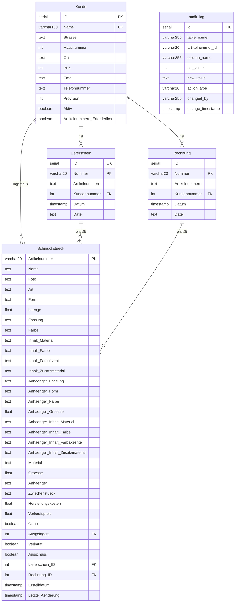

# GoldRegenDB – Schmuckverwaltung Web-Anwendung

## Projektübersicht

**GoldRegenDB** ist ein Warenwirtschaftssystem für handgefertigten Schmuck (Beton-, Perlen-, Holzschmuck u.a.).
Die bestehende MariaDB/MySQL-Datenbank wird auf **PostgreSQL** migriert und als moderne **Web-Anwendung** containerisiert (Docker).

---

## Datenbankschema

### ER-Diagramm



### Tabellen-Übersicht

| Tabelle        | Beschreibung                    | PK                  | Geschätzter Umfang |
| -------------- | ------------------------------- | ------------------- | ------------------ |
| `Kunde`        | Kunden / Händler / Lagerorte    | `Name` (UK: `ID`)   | ~25 Einträge       |
| `Lieferschein` | Lieferscheine mit Artikellisten | `Nummer` (UK: `ID`) | ~180 Einträge      |
| `Rechnung`     | Rechnungen mit Artikellisten    | `Nummer`            | ~200 Einträge      |
| `Schmuckstück` | Schmuckstücke mit 34 Attributen | `Artikelnummer`     | ~4.000+ Einträge   |
| `audit_log`    | Änderungsprotokoll              | `id`                | ~4.000+ Einträge   |

### Beziehungen (Foreign Keys)

- `Lieferschein.Kundennummer` → `Kunde.ID`
- `Rechnung.Kundennummer` → `Kunde.ID`
- `Schmuckstück.Ausgelagert` → `Kunde.ID` (Auslagerung zu Händler)
- `Schmuckstück.Lieferschein_ID` → `Lieferschein.ID`
- `Schmuckstück.Rechnung_ID` → `Rechnung.ID`

### Geschäftslogik

- **Kunden** sind Einzelhandelspartner (Läden, Online, Messen, Sonderanfertigung)
- **Provision**: variiert pro Kunde (0–40%)
- **Schmuckstücke** haben Suffix-Nummern (z.B. `MBH001_1`, `MBH001_2` = gleicher Typ, verschiedene Exemplare)
- **Artikelnummern-Präfixe**:
  - Erste Stelle (Hersteller):
    - `M` = Marina,
    - `S` = Saskia;
  - Zweite Stelle (Grundmaterial):
    - `A` = "Alkoholtinte",
    - `B` = "Beton",
    - `C` = "Cucio",
    - `E` = "Edelstahl",
    - `F` = "Fimo",
    - `H` = "Harz",
    - `I` = "Phiole",
    - `J` = "Papier",
    - `K` = "Kordel",
    - `L` = "Leder",
    - `M` = "Makramee",
    - `N` = "Naturstein",
    - `P` = "Perle",
    - `S` = "Schrumpffolie",
    - `W` = "Holz",
    - `X` = "3D-Druck"
    - `Y` = "Cabochon"
  - Dritte Stelle (Produktart):
    - `A` = "Armband",
    - `H` = "Halskette",
    - `O` = "Ohrring",
    - `S` = "Schlüsselanhänger",
- **Ausgelagert**: Referenz auf Kunden-ID, bei dem das Stück liegt (0 = im Lager)
- **Verkauft**: boolean, ob verkauft
- **Ausschuss**: boolean, ob aussortiert
- **audit_log**: automatisches Änderungsprotokoll via DB-Trigger

---

## Technologie-Stack

| Komponente       | Technologie                     |
| ---------------- | ------------------------------- |
| **Datenbank**    | PostgreSQL 16                   |
| **Backend**      | Node.js + Express.js (REST API) |
| **Frontend**     | React (Vite)                    |
| **ORM**          | Prisma oder Knex.js             |
| **Container**    | Docker + Docker Compose         |
| **Dev-Umgebung** | Docker Compose (dev)            |
| **Produktion**   | Docker Compose (prod)           |

---

## Projektstruktur

```
GoldRegenDB_Web/
├── docker-compose.yml          # Produktion
├── docker-compose.dev.yml      # Entwicklung (Hot Reload)
├── .env                        # Umgebungsvariablen
├── .env.example                # Vorlage
│
├── db/
│   ├── init.sql                # PostgreSQL-Schema (migriert)
│   └── seed.sql                # Initiale Daten (migriert)
│
├── backend/
│   ├── Dockerfile
│   ├── Dockerfile.dev
│   ├── package.json
│   └── src/
│       ├── index.js            # Express Entry-Point
│       ├── config/
│       │   └── db.js           # PostgreSQL-Verbindung
│       ├── routes/
│       │   ├── kunden.js
│       │   ├── schmuckstuecke.js
│       │   ├── lieferscheine.js
│       │   ├── rechnungen.js
│       │   └── auditLog.js
│       ├── controllers/
│       │   └── ...
│       └── middleware/
│           └── ...
│
├── frontend/
│   ├── Dockerfile
│   ├── Dockerfile.dev
│   ├── package.json
│   └── src/
│       ├── App.jsx
│       ├── pages/
│       │   ├── Dashboard.jsx
│       │   ├── Schmuckstuecke.jsx
│       │   ├── Kunden.jsx
│       │   ├── Lieferscheine.jsx
│       │   ├── Rechnungen.jsx
│       │   └── AuditLog.jsx
│       └── components/
│           └── ...
│
├── GoldRegenDB_data.sql        # Original MySQL/MariaDB Dump
└── GoldRegenDB_structure.sql   # Original Struktur-Dump
```

---

## Docker-Architektur

### Services

```yaml
# docker-compose.yml (Konzept)
services:
  db:
    image: postgres:16-alpine
    volumes:
      - pgdata:/var/lib/postgresql/data
      - ./db/init.sql:/docker-entrypoint-initdb.d/01-init.sql
      - ./db/seed.sql:/docker-entrypoint-initdb.d/02-seed.sql
    environment:
      POSTGRES_DB: goldregendb
      POSTGRES_USER: goldregen
      POSTGRES_PASSWORD: ${DB_PASSWORD}
    ports:
      - "5432:5432"

  backend:
    build: ./backend
    depends_on:
      - db
    environment:
      DATABASE_URL: postgresql://goldregen:${DB_PASSWORD}@db:5432/goldregendb
    ports:
      - "3001:3001"

  frontend:
    build: ./frontend
    depends_on:
      - backend
    ports:
      - "3000:3000"
```

### Dev-Modus

- Hot-Reload für Frontend und Backend
- Source-Volumes gemounted
- `docker-compose -f docker-compose.dev.yml up`

---

## MySQL → PostgreSQL Migration

### Wichtige Umstellungen

| MySQL/MariaDB                     | PostgreSQL                                   |
| --------------------------------- | -------------------------------------------- |
| `int(11) NOT NULL AUTO_INCREMENT` | `SERIAL` oder `GENERATED ALWAYS AS IDENTITY` |
| `` `backticks` ``                 | `"double_quotes"` oder keine Quotes          |
| `tinyint(1)`                      | `BOOLEAN`                                    |
| `double`                          | `DOUBLE PRECISION`                           |
| `current_timestamp()`             | `CURRENT_TIMESTAMP`                          |
| `ON UPDATE current_timestamp()`   | Trigger-Funktion                             |
| `ENGINE=InnoDB`                   | entfällt                                     |
| `COLLATE=utf8mb3_general_ci`      | `ENCODING 'UTF8'`                            |
| `/*!40101 ... */` Kommentare      | entfällt                                     |
| Umlaute in Tabellen-/Spaltennamen | In Anführungszeichen (`"Schmuckstück"`)      |

### Trigger für `Letzte_Änderung`

```sql
CREATE OR REPLACE FUNCTION update_letzte_aenderung()
RETURNS TRIGGER AS $$
BEGIN
    NEW."Letzte_Änderung" = CURRENT_TIMESTAMP;
    RETURN NEW;
END;
$$ LANGUAGE plpgsql;
```

### Trigger für `audit_log`

```sql
CREATE OR REPLACE FUNCTION audit_schmuckstueck_changes()
RETURNS TRIGGER AS $$
BEGIN
    -- Prüfe jede Spalte auf Änderungen
    -- INSERT into audit_log für jede geänderte Spalte
    RETURN NEW;
END;
$$ LANGUAGE plpgsql;
```

---

## Web-Anwendung – Geplante Features

### Phase 1: CRUD-Grundfunktionen

- [ ] Dashboard mit Statistiken (Gesamtbestand, ausgelagert, verkauft, Umsatz)
- [ ] Schmuckstücke: Liste, Filter, Suche, Erstellen, Bearbeiten
- [ ] Kunden: Liste, Erstellen, Bearbeiten, Detailansicht mit zugehörigen Stücken
- [ ] Lieferscheine: Liste, Erstellen (mit Artikelzuordnung)
- [ ] Rechnungen: Liste, Erstellen (mit Artikelzuordnung)
- [ ] Audit-Log: Anzeige der letzten Änderungen

### Phase 2: Erweiterte Features

- [ ] Foto-Upload für Schmuckstücke (statt Netzwerk-Pfaden)
- [ ] PDF-Generierung für Lieferscheine und Rechnungen
- [ ] Barcode-/QR-Code-Scanner für Artikelnummern
- [ ] Filterable Bestandsübersicht pro Kunde
- [ ] Export-Funktionen (CSV, Excel)

### Phase 3: Fortgeschritten

- [ ] Benutzer-Authentifizierung und Rollenverwaltung
- [ ] Multi-Mandanten-Fähigkeit
- [ ] Statistik-Dashboard mit Diagrammen
- [ ] Automatische E-Mail-Benachrichtigungen

---

## Entwicklungs-Workflow

```bash
# 1. Projekt starten (Entwicklung)
docker-compose -f docker-compose.dev.yml up --build

# 2. Datenbank wird automatisch initialisiert
#    (init.sql + seed.sql via docker-entrypoint-initdb.d)

# 3. Frontend: http://localhost:3000
# 4. Backend API: http://localhost:3001/api
# 5. Datenbank: localhost:5432

# Produktions-Build
docker-compose up --build -d
```

---

## SQL-Quelldateien

- [GoldRegenDB_structure.sql](file:///home/olivers/Dokumente/GoldRegenDB_Web/GoldRegenDB_structure.sql) — Original MySQL/MariaDB Tabellenstruktur
- [GoldRegenDB_data.sql](file:///home/olivers/Dokumente/GoldRegenDB_Web/GoldRegenDB_data.sql) — Original Datenexport (~3.2 MB, ~12.400 Zeilen)

---

## Nächste Schritte

1. **PostgreSQL-Schema erstellen** (`db/init.sql`) — MySQL zu PostgreSQL konvertieren
2. **Seed-Daten konvertieren** (`db/seed.sql`) — INSERT-Statements anpassen
3. **Docker Compose Setup** — DB, Backend, Frontend Container
4. **Backend API** — REST-Endpunkte für alle Tabellen
5. **Frontend** — React-App mit CRUD-Oberfläche
